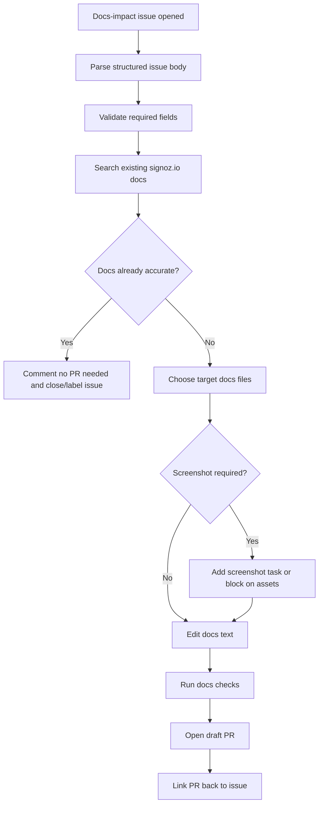
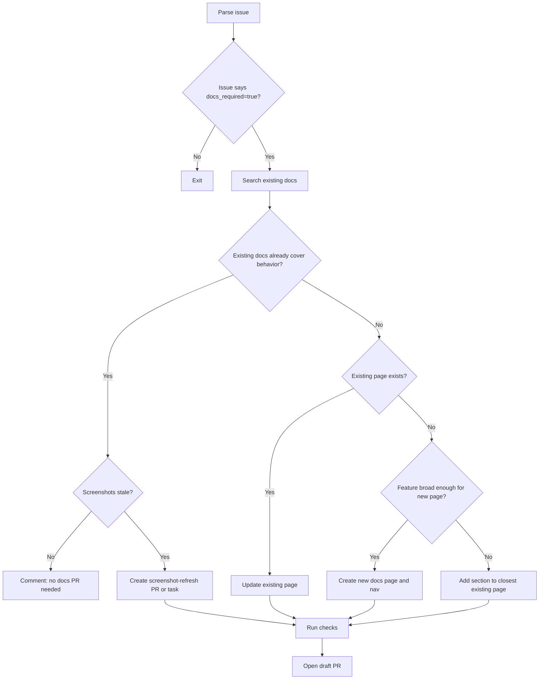
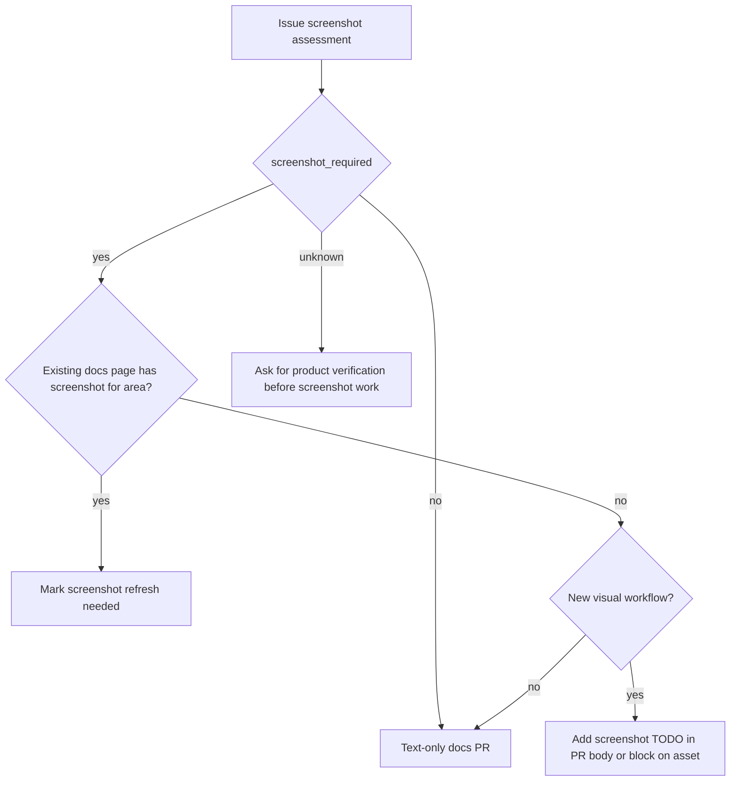

# SigNoz Docs Repo: Docs Issue to PR Workflow

This file describes the GitHub Action behavior for `SigNoz/signoz.io`. Its job is to consume a structured docs-impact issue created from `SigNoz/signoz`, search the existing docs, decide the exact docs change, and open a draft PR.

The action should not blindly turn issue text into docs. It must verify that docs are actually missing or stale in `signoz.io`.

## Trigger

Run when a docs-impact issue is opened or labeled.

```yaml
on:
  issues:
    types: [opened, labeled]

jobs:
  docs-pr:
    if: contains(github.event.issue.labels.*.name, 'docs-impact')
```

Optional manual trigger:

```yaml
on:
  workflow_dispatch:
    inputs:
      issue_number:
        required: true
        type: string
```

## High-Level Flow



## Required Issue Fields

The workflow must parse these fields from the issue:

- Source product PR URL
- Product PR number
- Merge commit SHA
- Product change summary
- Change type
- Changed files summary
- User reachability verification
- Screenshot assessment
- Existing docs search hints
- Suggested target pages
- Acceptance criteria

If any of these are missing, do not create a PR. Comment on the issue with the missing fields and add:

```text
needs-product-context
```

## Required Search Before Editing

Before changing docs, search the repo using the issue's hints and product area.

Minimum search commands:

```bash
rg -n "<primary keyword>" data/docs constants app components utils
rg -n "<secondary keyword>" data/docs constants app components utils
rg -n "<UI label or route>" data/docs constants
```

For screenshots:

```bash
rg -n "<feature keyword>" public/img data/docs
```

For docs navigation:

```bash
rg -n "<target route or doc title>" constants/docsSideNav.ts
```

For redirects if a URL changes:

```bash
rg -n "<old route|new route>" next.config.js constants/docsSideNav.ts data/docs
```

## Decision Flow



## Target File Selection Rules

Prefer updating an existing page over creating a new page.

| Product area | Search first | Typical target |
| --- | --- | --- |
| Traces / trace details | `trace details`, `span details`, `waterfall`, `flamegraph` | `data/docs/userguide/span-details.mdx`, traces management docs |
| Logs Explorer | `logs explorer`, `query builder`, `quick filters`, `log detail` | `data/docs/product-features/logs-explorer.mdx`, `data/docs/userguide/logs_query_builder.mdx` |
| Query Builder | `query builder`, `formula`, `aggregation`, `filter` | query-builder docs |
| Dashboards | `dashboard`, `panel`, `interactivity`, `variables` | `data/docs/userguide/manage-dashboards.mdx`, `data/docs/dashboards/interactivity.mdx` |
| Alerts | `alerts`, `alert rules`, `triggered alerts`, `notification` | `data/docs/alerts-management/**` |
| Infrastructure Monitoring | `infrastructure monitoring`, `Kubernetes`, `hosts`, `pods`, `nodes` | `data/docs/infrastructure-monitoring/**` |
| Settings / IAM / SSO | `settings`, `members`, `service accounts`, `SSO`, `roles` | `data/docs/manage/administrator-guide/**` |
| APIs | endpoint name, schema type, OpenAPI tags | API reference docs or relevant feature docs |
| Install/config | config key, env var, chart value, deployment file | `data/docs/install/**`, `data/docs/operate/**`, collection agent docs |

## Edit Rules

The action must follow SigNoz docs rules:

- Internal links must be absolute `https://signoz.io/docs/...` URLs.
- External links must use MDX anchor form:

```mdx
<a href="https://example.com" target="_blank" rel="noopener noreferrer nofollow">Example</a>
```

- Do not create duplicate pages for already documented features.
- Do not document implementation details unless users need them.
- Do not claim behavior that was not verified in the issue packet or existing docs.
- If the issue says `screenshot_required=unknown`, do not invent screenshot steps. Add a PR note or issue comment asking for product verification.

## Screenshot Handling

Initial version may only identify whether screenshots are required.

Use this logic:



For now, if screenshot capture is not automated, the PR body must include:

```md
## Screenshot Follow-up

- screenshot_required: `yes`
- affected page: `<page>`
- capture steps:
  1. `<step>`
  2. `<step>`
- status: not included in this PR
```

If screenshot is required and the docs page cannot be accurate without it, add label:

```text
blocked-on-screenshot
```

## Branch and PR Conventions

Branch:

```text
codex/docs-signoz-<product-pr-number>-<short-slug>
```

Commit:

```text
docs: update <area> for signoz#<product-pr-number>
```

PR title:

```text
docs: update <area> for SigNoz/signoz#<product-pr-number>
```

PR body:

```md
## What changed

- <docs update>
- <screenshot update or note>

## Source product PR

SigNoz/signoz#<number>

## Source docs issue

Closes #<issue-number>

## Verification

- [ ] Existing docs searched before editing
- [ ] No duplicate docs coverage introduced
- [ ] User-facing behavior verified from issue packet
- [ ] Screenshots handled or explicitly deferred

Commands:

- `yarn check:docs-metadata`
- `yarn test:docs-metadata`
- `yarn check:doc-redirects`
- `yarn test:doc-redirects`
```

## Validation Commands

For docs-only changes:

```bash
yarn check:docs-metadata
yarn test:docs-metadata
yarn check:doc-redirects
yarn test:doc-redirects
```

For docs plus site-code changes:

```bash
yarn lint
yarn build
```

If the workflow edits docs rendering utilities or MDX components, also inspect:

- `utils/docs/agentMarkdownStubs.ts`
- `utils/docs/buildCopyMarkdownFromRendered.ts`

## Failure Modes

### Existing Docs Already Cover the Change

Do not open a PR. Comment:

```md
No docs PR opened.

I searched:
- `<term>`
- `<term>`

Existing docs already cover the behavior here:
- `<doc path>`

Screenshot required: `<yes|no|unknown>`
```

Add label:

```text
docs-not-needed-after-review
```

### Issue Packet Is Too Vague

Do not open a PR. Comment:

```md
Cannot safely update docs from this issue yet.

Missing:
- verified render path
- affected page/control
- screenshot requirement
- exact user-facing behavior

Please update the source docs-impact packet.
```

Add label:

```text
needs-product-context
```

### Product Behavior Cannot Be Verified

Do not write speculative docs. Comment:

```md
Docs update blocked because product behavior is not verified.

Unverified claims:
- `<claim>`

Needed:
- route/page confirmation
- feature flag status
- UI screenshot or reproduction steps
```

Add label:

```text
needs-product-verification
```

## Automation Boundary

The `signoz.io` action may:

- search docs
- choose target files
- update text
- update nav/redirects when explicitly needed
- open a draft PR
- add a screenshot follow-up note

The `signoz.io` action must not:

- invent product behavior from a PR title
- create duplicate docs without searching
- mark screenshots as updated when no asset changed
- document feature-flagged or unreachable UI as generally available
- merge its own PR

