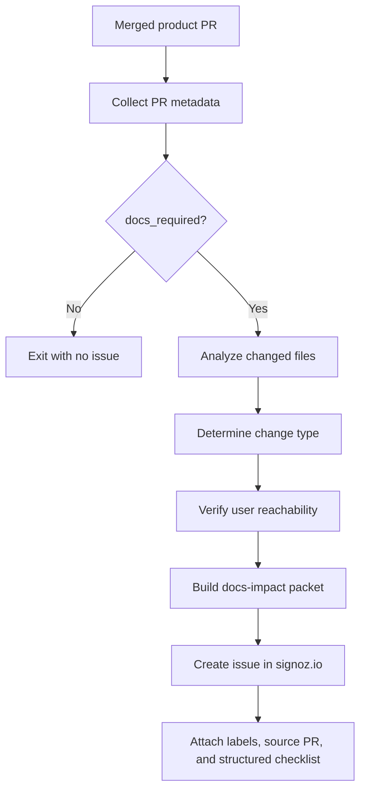

# SigNoz Main Repo: Docs Ticket Creation Workflow

This file describes the GitHub Action behavior for `SigNoz/signoz`. Its job is to convert a merged product PR into a complete docs-impact ticket when `docs_required` is `true`.

The action should not write docs. It should gather enough verified product context that a downstream `signoz.io` workflow can update docs without guessing from the PR title.

## Trigger

Run after a PR is merged into the default branch.

```yaml
on:
  pull_request:
    types: [closed]

jobs:
  create-docs-ticket:
    if: github.event.pull_request.merged == true
```

The workflow may also run manually for a PR number:

```yaml
on:
  workflow_dispatch:
    inputs:
      pr_number:
        required: true
        type: string
```

## High-Level Flow



## Required Inputs

The action needs:

- Product PR number
- Product PR title
- Product PR URL
- Product PR author
- Merge commit SHA
- Base branch and head branch
- Labels on the product PR
- Full PR body
- Changed files with additions/deletions/change type
- Commit messages included in the PR
- PR comments or review summary if available
- `docs_required` value from your upstream classifier

## Required Output

If `docs_required == false`, exit successfully and write a short job summary:

```text
No docs issue created.
Reason: docs_required=false.
Product PR: <url>
```

If `docs_required == true`, create one issue in `SigNoz/signoz.io`.

Issue title format:

```text
docs: update for SigNoz/signoz#<PR_NUMBER> - <short product area>
```

Labels:

```text
docs-impact
from-signoz-main
needs-docs-triage
```

Optional labels based on classification:

```text
screenshot-review
api-docs
ui-docs
install-config-docs
release-note-candidate
```

## Docs-Impact Packet

The issue body must be structured and machine-readable enough for the downstream repo. Use this exact shape.

```md
## Source PR

- Product PR: <https://github.com/SigNoz/signoz/pull/PR_NUMBER>
- Title: <PR title>
- Merged at: <timestamp>
- Merge commit: `<sha>`
- Author: @<author>
- Labels: `<label-1>`, `<label-2>`

## Docs Decision

- docs_required: `true`
- classifier_confidence: `<high|medium|low>`
- reason: `<short reason from classifier>`

## Product Change Summary

<Plain-English summary of what changed. This must describe user-visible behavior, not just code structure.>

## Change Type

Select all that apply:

- [ ] New user-facing feature
- [ ] Changed existing UI
- [ ] New or changed API
- [ ] Config, deployment, or installation change
- [ ] Permission, auth, or access-control change
- [ ] Query behavior change
- [ ] Alerting behavior change
- [ ] Screenshot-only UI change
- [ ] Developer/internal docs only

## Changed Files Summary

| Area | Files | Why it matters |
| --- | --- | --- |
| UI | `<file paths>` | `<rendered surface or component>` |
| API/backend | `<file paths>` | `<endpoint/module/behavior>` |
| config/deploy | `<file paths>` | `<operator-facing behavior>` |
| generated/openapi | `<file paths>` | `<schema/client impact>` |

## User Reachability Verification

- routed_in_ui: `<yes|no|not_applicable|unknown>`
- route_or_page: `<route/page/component if known>`
- feature_flagged: `<yes|no|unknown>`
- feature_flag_name: `<flag name or N/A>`
- enabled_by_default: `<yes|no|unknown>`
- preference_or_localstorage_gate: `<yes|no|unknown>`
- permission_or_plan_gate: `<yes|no|unknown>`
- verified_render_path:
  - `<route -> page -> container -> component>`

## UI Screenshot Assessment

- screenshot_required: `<yes|no|unknown>`
- reason: `<why a screenshot is or is not needed>`
- affected_page: `<UI path, route, or nav path>`
- affected_option_or_control: `<button/tab/dropdown/table/setting>`
- suggested_capture_steps:
  1. `<Navigate to ...>`
  2. `<Select ...>`
  3. `<Set up sample data or state ...>`
  4. `<Capture ...>`
- required_state:
  - data state: `<with data|empty state|error state|specific entity>`
  - user role: `<admin/editor/viewer/etc>`
  - deployment type: `<Cloud|OSS|Enterprise|N/A>`

## Existing Docs Search Hints

Search these terms in `signoz.io`:

- `<keyword 1>`
- `<keyword 2>`
- `<route name or product area>`
- `<component/domain term>`

Likely docs areas:

- `<data/docs/...>`
- `<constants/docsSideNav.ts if nav changes>`
- `<next.config.js if URL changes>`

## Suggested Docs Update

- likely_docs_action: `<new page|new section|update existing page|screenshot refresh|API docs|no textual update, screenshot only>`
- suggested_target_pages:
  - `<data/docs/...>`
- content_that_changed:
  - `<exact behavior change>`
  - `<new field/setting/control/API/config>`
  - `<default, limitation, or migration note>`
- content_to_avoid:
  - `<claims not verified>`
  - `<implementation details users do not need>`

## Acceptance Criteria

- [ ] Existing docs searched before editing
- [ ] No duplicate docs page or duplicate section created
- [ ] User-facing behavior verified against changed code
- [ ] Feature flags or gates checked
- [ ] Screenshots updated if required
- [ ] Internal links use absolute `https://signoz.io/docs/...` URLs
- [ ] External links use MDX anchor tags with required `rel`
- [ ] Required docs checks pass

## Raw PR Data

<details>
<summary>Changed files</summary>

```text
<file list with additions/deletions>
```

</details>

<details>
<summary>Relevant PR body excerpt</summary>

```text
<summary/changelog/testing sections only>
```

</details>
```

## Product PR Analysis Instructions

The action should build the issue body using the checks below.

### 1. Classify From Files

Use changed files to identify affected areas:

| Pattern | Area | Docs implication |
| --- | --- | --- |
| `frontend/src/pages/**` | UI route/page | Possible user-facing docs or screenshot |
| `frontend/src/container/**` | UI workflow/component | Possible existing docs update |
| `frontend/src/AppRoutes/**` | Routing | New or changed page reachability |
| `frontend/src/constants/routes.ts` | Routing | New URL or navigation behavior |
| `frontend/src/store/**` | User-visible state only if rendered | Verify UI usage |
| `pkg/apiserver/**` | API | API docs candidate |
| `pkg/modules/**` | Product behavior/API | Docs candidate if user-facing |
| `pkg/types/**` | API/schema/domain types | Docs candidate if exposed |
| `docs/api/openapi.yml` | API schema | API docs candidate |
| `deploy/**`, `docker/**`, `charts/**`, `*.yaml` | Installation/config | Install/config docs candidate |
| `*.test.*`, `*.spec.*` only | Tests | No docs |
| lockfiles only | Dependency/internal | No docs |
| style files only | Cosmetic | Usually screenshot-review only |

### 2. Verify Reachability

For UI changes, do not assume changed code is visible.

Check:

- Is the component routed?
- Is the component imported and rendered?
- Is it behind a feature flag?
- Is it behind a user preference or local storage toggle?
- Is it only used in tests/storybook/dead code?
- Is the change visible for all users or only certain roles/plans?

Useful commands:

```bash
git show <merge-sha> -- frontend/src/AppRoutes/routes.ts
git show <merge-sha> -- frontend/src/AppRoutes/pageComponents.ts
git grep -n "ComponentName" <merge-sha>
git grep -n "featureFlag\\|FeatureKeys\\|isFeatureEnabled\\|localStorage\\|LOCALSTORAGE" <merge-sha> -- frontend/src
```

### 3. Decide Screenshot Requirement

Set `screenshot_required=yes` when:

- A documented UI workflow changed visually
- A new page, drawer, modal, tab, table, filter, chart, or setting was added
- Existing screenshots likely show stale labels, layout, or controls
- PR body includes screenshots and the docs page already has screenshots for that area

Set `screenshot_required=no` when:

- API-only change
- Backend behavior change without UI representation
- Text-only copy change already described without screenshot dependency
- Internal refactor or generated code only

Set `screenshot_required=unknown` when:

- UI changed but route/render path was not confirmed
- UI changed behind a feature flag or permission gate
- The PR body lacks enough detail to reproduce the state

### 4. Required Issue Quality Bar

Do not create a vague issue like:

```text
Update docs for PR #123.
```

The issue must contain:

- what changed
- where it appears in the product
- why docs are needed
- which docs are likely affected
- whether screenshots are needed
- how to reproduce the UI state for screenshots
- what claims are verified vs uncertain

If the action cannot produce that, create the issue with label `needs-human-product-context` and mark uncertain fields explicitly.

