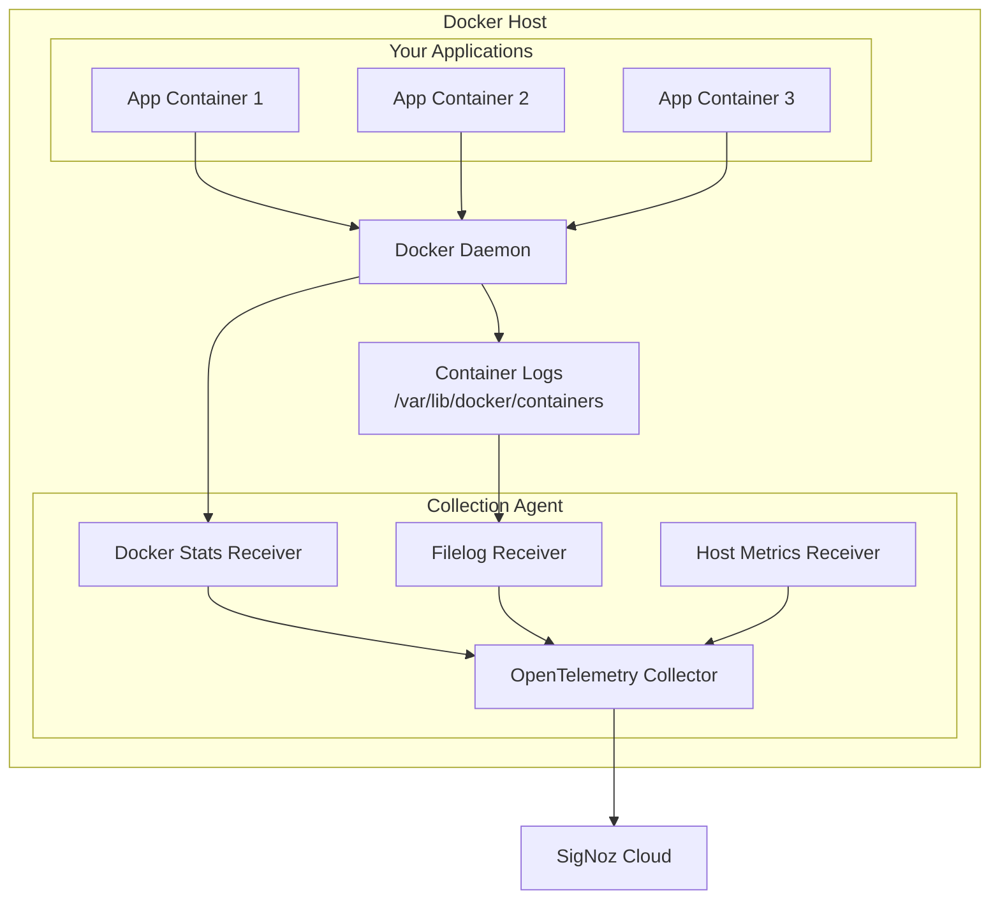

# Docker Collection Agent - Overview

## What is Docker Collection Agent?

The Docker Collection Agent is a containerized OpenTelemetry Collector that runs alongside your Docker containers to collect logs, metrics, and traces from your Docker environment. It provides comprehensive observability for containerized applications without requiring changes to your existing Docker setup.

## Key Features

- **📊 Complete Observability**: Collect logs, metrics, and traces from Docker containers
- **🔄 Real-time Collection**: Stream telemetry data with minimal latency  
- **🏷️ Rich Metadata**: Automatic container labels, environment variables, and resource attributes
- **⚡ High Performance**: Efficient resource usage with configurable batching and filtering
- **🔧 Easy Setup**: Simple installation with Docker run or Docker Compose
- **🌐 Cross-platform**: Works on Linux, macOS, and Windows Docker environments

## Architecture

## What Gets Collected

### 📋 Container Logs
- **Application logs** from all running containers
- **Container lifecycle events** (start, stop, restart)
- **Error logs** and stack traces
- **Structured and unstructured** log formats

**Automatic Metadata:**
- Container name, image, and labels
- Environment variables  
- Namespace and pod information (if applicable)
- Host and timestamp information

### 📈 Container Metrics  
- **Resource usage**: CPU, memory, disk, network
- **Container state**: Running, stopped, restart count
- **Docker daemon metrics**: Image pulls, container operations
- **Custom application metrics** (via OTLP)

### 🔍 Distributed Traces
- **Request tracing** across container boundaries  
- **Service dependencies** and call graphs
- **Performance bottlenecks** and latency analysis
- **Error propagation** tracking

## Supported Environments

| Environment | Support | Notes |
|-------------|---------|-------|
| **Docker Engine** | ✅ Full | Linux, Windows, macOS |
| **Docker Desktop** | ✅ Full | macOS, Windows |
| **Docker Swarm** | ✅ Full | Multi-node deployments |
| **Docker Compose** | ✅ Full | Single and multi-container apps |
| **Podman** | ⚠️ Partial | Compatible with minor config changes |

## Use Cases

### 🏢 Production Monitoring
- Monitor containerized microservices in production
- Set up alerts on container resource usage and errors  
- Track application performance and SLA compliance
- Troubleshoot issues across distributed systems

### 🧪 Development & Testing
- Debug applications during local development
- Monitor resource usage in staging environments
- Validate application behavior before production
- Performance testing and optimization

### 🔍 Troubleshooting
- Correlate logs, metrics, and traces for root cause analysis
- Track down intermittent issues in containerized apps
- Monitor container lifecycle and deployment issues
- Analyze resource constraints and scaling needs

## Comparison with Other Solutions

| Feature | Docker Collection Agent | Logspout | Fluentd | Filebeat |
|---------|------------------------|----------|---------|----------|
| **Logs** | ✅ | ✅ | ✅ | ✅ |
| **Metrics** | ✅ | ❌ | ⚠️ Plugin | ⚠️ Plugin |
| **Traces** | ✅ | ❌ | ❌ | ❌ |
| **OTLP Native** | ✅ | ❌ | ❌ | ❌ |
| **Resource Usage** | Low | Very Low | Medium | Low |
| **Configuration** | YAML | ENV vars | Ruby | YAML |
| **Maintenance** | Active | Deprecated | Active | Active |

## Requirements

### System Requirements
- **Docker Engine**: 20.10+ (recommended)
- **Memory**: 512MB RAM minimum, 1GB recommended  
- **CPU**: 0.5 CPU cores minimum, 1 core recommended
- **Disk**: 100MB free space for agent, additional for log buffering
- **Network**: Outbound HTTPS (443) access to SigNoz Cloud

### Permissions
- **File access**: Read access to Docker log directories
- **Docker API**: Access to Docker daemon socket (for metrics)
- **Network**: Ability to bind to collection ports (4317, 4318)

## Security Considerations

- **Privileged Access**: Agent needs read access to Docker log files
- **Network Security**: Secure communication with SigNoz Cloud via TLS
- **Data Privacy**: Configure filtering to exclude sensitive information
- **Resource Limits**: Set memory and CPU limits to prevent resource exhaustion

## Next Steps

Ready to get started? 

1. **[📥 Install the Agent](./install)** - Set up the collection agent in your Docker environment
2. **[⚙️ Configuration](./configuration)** - Customize data collection for your needs  
3. **[🔧 Troubleshooting](./troubleshooting)** - Resolve common issues and optimize performance

Or explore specific collection scenarios:
- **[📋 Docker Logs](../docker-logs/)** - Collect and parse container logs
- **[📊 Docker Metrics](../docker-metrics/)** - Monitor container and host metrics  
- **[🔍 Application Tracing](../docker-traces/)** - Set up distributed tracing