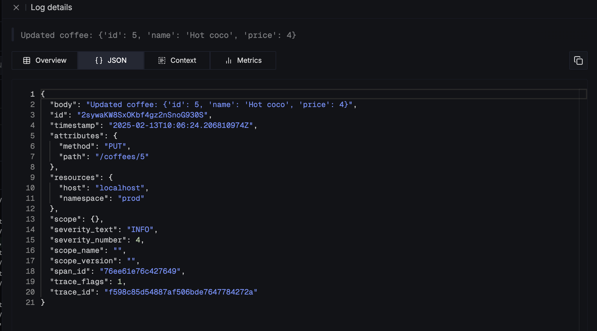

{/* 
import InstrumentationFAQ from '@/components/shared/instrumentation-faq.md'


This documentation contains instructions on how to set up OpenTelemetry(OTel) instrumentation in your C++ application. OpenTelemetry, also known as OTel for short, is an open-source observability framework that can help you generate and collect telemetry data - traces, metrics, and logs from your Swift application.


Once the telemetry data is generated, you can configure an exporter to send the data to SigNoz for monitoring and visualization.

There are three major steps to using OpenTelemetry:

- Instrumenting your C++ application with OpenTelemetry
- Configuring the exporter to send data to SigNoz
- Validating the configuration to ensure that data is being sent as expected.

In this tutorial, we will instrument a C++ application for traces and send it to SigNoz.

*/}

This document contains instructions on how to set up OpenTelemetry instrumentation in your C++ applications and view your application traces in SigNoz.

## Requirements

- [Bazel](https://bazel.build/)

## Send Traces to SigNoz

Based on your application environment, you can choose the setup below to send traces to SigNoz.

<Tabs entityName="plans">
<TabItem value="signoz-cloud" label="SigNoz Cloud" default>
### Send traces to SigNoz Cloud via OTel Collector binary

**Step 1 : Install OTel Collector**

OTel Collector binary helps to collect logs, hostmetrics, resource and infra attributes. You can find instructions to install OTel Collector binary [here](https://signoz.io/docs/tutorial/opentelemetry-binary-usage-in-virtual-machine/) in your VM.

**Step 2 : Build opentelemetry-cpp locally**

To configure your C++ application to send traces to OpenTelemetry you need to install [opentelemetry-cpp](https://github.com/open-telemetry/opentelemetry-cpp.git) and add it as dependency in your project.

Build `opentelemetry-cpp` locally using Bezel, following these steps:

- Clone the `opentelemetry-cpp` source code.

```bash
git clone https://github.com/open-telemetry/opentelemetry-cpp.git
```

- Navigate to the repository cloned above, download the dependencies and build the source code:

```bash
cd opentelemetry-cpp
bazel build //...
```

- Once Bazel tests are built, run them with `bazel test //...` command

```bash
bazel test //...
```

**Step 3 : Instrument your application with OpenTelemetry**

Add the following to `BUILD` file:

```bash
cc_binary(
    name = "<name>",
    srcs = [
        "<file_name>.cc",
    ],
    tags = [
        "examples",
        "otlp",
        "otlp_http",
    ],
    deps = [
        "//api",
        "//exporters/otlp:otlp_http_exporter",
        "//sdk/src/trace",
    ],
)
```

Add the following content to `main.cpp`:

```cpp
#include <memory>
#include <string>
#include <utility>

#include "opentelemetry/exporters/otlp/otlp_environment.h"
#include "opentelemetry/exporters/otlp/otlp_http.h"
#include "opentelemetry/exporters/otlp/otlp_http_exporter_factory.h"
#include "opentelemetry/exporters/otlp/otlp_http_exporter_options.h"
#include "opentelemetry/sdk/common/global_log_handler.h"
#include "opentelemetry/sdk/trace/processor.h"
#include "opentelemetry/sdk/trace/recordable.h"
#include "opentelemetry/sdk/trace/simple_processor_factory.h"
#include "opentelemetry/sdk/trace/tracer_provider.h"
#include "opentelemetry/sdk/trace/tracer_provider_factory.h"
#include "opentelemetry/trace/provider.h"
#include "opentelemetry/trace/span_id.h"
#include "opentelemetry/trace/tracer_provider.h"

namespace trace     = opentelemetry::trace;
namespace trace_sdk = opentelemetry::sdk::trace;
namespace otlp      = opentelemetry::exporter::otlp;

namespace internal_log = opentelemetry::sdk::common::internal_log;

namespace
{
opentelemetry::exporter::otlp::OtlpHttpExporterOptions opts;

std::shared_ptr<opentelemetry::sdk::trace::TracerProvider> provider;

void InitTracer()
{
  auto exporter  = otlp::OtlpHttpExporterFactory::Create(opts);
  auto processor = trace_sdk::SimpleSpanProcessorFactory::Create(std::move(exporter));
  provider       = trace_sdk::TracerProviderFactory::Create(std::move(processor));
  std::shared_ptr<opentelemetry::trace::TracerProvider> api_provider = provider;
  trace::Provider::SetTracerProvider(api_provider);
}

void CleanupTracer()
{
  // We call ForceFlush to prevent to cancel running exportings, It's optional.
  if (provider)
  {
    provider->ForceFlush();
  }

  provider.reset();
  std::shared_ptr<opentelemetry::trace::TracerProvider> none;
  trace::Provider::SetTracerProvider(none);
}
}  // namespace

int main()
{
  InitTracer();

  foo_library();

  CleanupTracer();
}
```

This code sets up OpenTelemetry tracing in your C++ application, initializes a tracer with an OTLP HTTP exporter, processes spans, and sends trace data to a SigNoz.

**Step 4: Run app**

Execute your application by issuing the run command:

```
bazel run <name>
```

`<name>` refers to the name of the binary target for your application, which you define in the `BUILD` file.

</TabItem>
<TabItem value='self-host' label='Self-Host'>
### Send Traces to Self-Hosted SigNoz via Otel Collector


**Step 1 : Install OTel Collector**

OTel Collector binary helps to collect logs, hostmetrics, resource and infra attributes. You can find instructions to install OTel Collector binary [here](https://signoz.io/docs/tutorial/opentelemetry-binary-usage-in-virtual-machine/) in your VM.

**Step 2 : Build opentelemetry-cpp locally**

To configure your C++ application to send traces to OpenTelemetry you need to install [opentelemetry-cpp](https://github.com/open-telemetry/opentelemetry-cpp.git) and add it as dependency in your project.

Build `opentelemetry-cpp` locally using Bezel, following these steps:

- Clone the `opentelemetry-cpp` source code.

```bash
git clone https://github.com/open-telemetry/opentelemetry-cpp.git
```

- Navigate to the repository cloned above, download the dependencies and build the source code:

```bash
cd opentelemetry-cpp
bazel build //...
```

- Once Bazel tests are built, run them with `bazel test //...` command

```bash
bazel test //...
```

**Step 3 : Instrument your application with OpenTelemetry**

Add the following to `BUILD` file:

```bash
cc_binary(
    name = "<name>",
    srcs = [
        "<file_name>.cc",
    ],
    tags = [
        "examples",
        "otlp",
        "otlp_http",
    ],
    deps = [
        "//api",
        "//exporters/otlp:otlp_http_exporter",
        "//sdk/src/trace",
    ],
)
```

Add the following content to `main.cpp`:

```cpp
#include <memory>
#include <string>
#include <utility>

#include "opentelemetry/exporters/otlp/otlp_environment.h"
#include "opentelemetry/exporters/otlp/otlp_http.h"
#include "opentelemetry/exporters/otlp/otlp_http_exporter_factory.h"
#include "opentelemetry/exporters/otlp/otlp_http_exporter_options.h"
#include "opentelemetry/sdk/common/global_log_handler.h"
#include "opentelemetry/sdk/trace/processor.h"
#include "opentelemetry/sdk/trace/recordable.h"
#include "opentelemetry/sdk/trace/simple_processor_factory.h"
#include "opentelemetry/sdk/trace/tracer_provider.h"
#include "opentelemetry/sdk/trace/tracer_provider_factory.h"
#include "opentelemetry/trace/provider.h"
#include "opentelemetry/trace/span_id.h"
#include "opentelemetry/trace/tracer_provider.h"

namespace trace     = opentelemetry::trace;
namespace trace_sdk = opentelemetry::sdk::trace;
namespace otlp      = opentelemetry::exporter::otlp;

namespace internal_log = opentelemetry::sdk::common::internal_log;

namespace
{
opentelemetry::exporter::otlp::OtlpHttpExporterOptions opts;

std::shared_ptr<opentelemetry::sdk::trace::TracerProvider> provider;

void InitTracer()
{
  auto exporter  = otlp::OtlpHttpExporterFactory::Create(opts);
  auto processor = trace_sdk::SimpleSpanProcessorFactory::Create(std::move(exporter));
  provider       = trace_sdk::TracerProviderFactory::Create(std::move(processor));
  std::shared_ptr<opentelemetry::trace::TracerProvider> api_provider = provider;
  trace::Provider::SetTracerProvider(api_provider);
}

void CleanupTracer()
{
  // We call ForceFlush to prevent to cancel running exportings, It's optional.
  if (provider)
  {
    provider->ForceFlush();
  }

  provider.reset();
  std::shared_ptr<opentelemetry::trace::TracerProvider> none;
  trace::Provider::SetTracerProvider(none);
}
}  // namespace

int main()
{
  InitTracer();

  foo_library();

  CleanupTracer();
}
```

This code sets up OpenTelemetry tracing in your C++ application, initializes a tracer with an OTLP HTTP exporter, processes spans, and sends trace data to a SigNoz.

**Step 4: Run app**

Execute your application by issuing the run command:

```
bazel run <name>
```

`<name>` refers to the name of the binary target for your application, which you define in the `BUILD` file.

</TabItem>
</Tabs>


## Link logs and traces

Logs and traces provide valuable insights into an app's performance. While logs capture event details with timestamps, traces track a request’s journey across different components, highlighting latency and bottlenecks. 
Linking logs and traces using a common trace ID helps you pinpoint issues, analyze failures, and optimize performance.


### Generate traces

To trace a request from start to finish, you need to generate spans for each operation. OpenTelemetry provides automatic instrumentation for various frameworks.

Follow these steps to generate traces:

1. Configure tracing using OpenTelemetry. 
    ```cpp
    #include <iostream>
    #include <string>
    #include <thread>
    #include <chrono>
    #include <nlohmann/json.hpp>
    #include <opentelemetry/exporters/otlp/otlp_grpc_exporter.h>
    #include <opentelemetry/sdk/resource/resource.h>
    #include <opentelemetry/sdk/trace/simple_processor.h>
    #include <opentelemetry/sdk/trace/tracer_provider.h>
    #include <opentelemetry/trace/provider.h>
    #include <opentelemetry/trace/span.h>
    #include <opentelemetry/trace/scope.h>
    #include <opentelemetry/context/runtime_context.h>
    #include <cpprest/http_client.h>

    namespace trace = opentelemetry::trace;
    namespace sdktrace = opentelemetry::sdk::trace;
    namespace context = opentelemetry::context;
    namespace otlp = opentelemetry::exporter::otlp;

    const std::string SIGNOZ_INGESTION_KEY = "<SigNoz-ingestion-key>";
    const std::string SIGNOZ_LOGS_URL = "https://ingest.{region}.signoz.cloud:443/v1/logs";
    const std::string SIGNOZ_OTLP_ENDPOINT = "https://ingest.{region}.signoz.cloud:443/v1/traces";

    std::shared_ptr<trace::Tracer> InitTracer()
    {
        auto exporter = std::unique_ptr<sdktrace::SpanExporter>(new otlp::OtlpGrpcExporter(otlp::OtlpGrpcExporterOptions{SIGNOZ_OTLP_ENDPOINT}));
        auto processor = std::unique_ptr<sdktrace::SpanProcessor>(new sdktrace::SimpleSpanProcessor(std::move(exporter)));
        auto resource = opentelemetry::sdk::resource::Resource::Create({{"service.name", "CoffeeShopService"}});
        
        auto provider = std::make_shared<sdktrace::TracerProvider>(std::move(processor), resource);
        opentelemetry::trace::Provider::SetTracerProvider(provider);
        return provider->GetTracer("CoffeeShopService");
    }

    std::string GetTraceID()
    {
        auto span = trace::GetSpan(context::RuntimeContext::GetCurrent());
        if (span)
        {
            return span->GetContext().trace_id().ToHex();
        }
        return "";
    }

    std::string GetSpanID()
    {
        auto span = trace::GetSpan(context::RuntimeContext::GetCurrent());
        if (span)
        {
            return span->GetContext().span_id().ToHex();
        }
        return "";
    }
   
    ```
1. Create spans for each method to track its execution. For example, consider a method to get coffee.
    ```cpp
    void GetCoffee()
    {
      auto tracer = opentelemetry::trace::Provider::GetTracerProvider()->GetTracer("CoffeeShopService");
      auto span = tracer->StartSpan("GetCoffee");

      trace::Scope scope(span);
      LogRequest("GetCoffee");

      // Simulate coffee preparation
      std::this_thread::sleep_for(std::chrono::milliseconds(500));

      LogResponse("GetCoffee");

      span->End();
    }
    ```

### Generate logs

Logs provide detailed insights at different request execution stages. Include contextual details such as timestamps, severity levels, and message descriptions.

1. Attach log information each method. You can optionally add logs before and after each request.
    ```cpp
    void LogRequest(const std::string &methodName)
    {
        std::string message = "Incoming request: " + methodName;
        std::cout << "INFO: " << message << " - Trace ID: " << GetTraceID() << std::endl;
        SendLogToSigNoz("INFO", message);
    }

    void LogResponse(const std::string &methodName)
    {
        std::string message = "Response sent from: " + methodName;
        std::cout << "INFO: " << message << " - Trace ID: " << GetTraceID() << std::endl;
        SendLogToSigNoz("INFO", message);
    }
    ```
1.  You can add more information to log for each method.

### Link logs with traces

To correlate logs with traces, include `trace_id` and `span_id` in the log.

Follow these steps to link logs with traces:

1. Add trace and span information in the log message.
    ```cpp
    void SendLogToSigNoz(const std::string &level, const std::string &message)
    {
        nlohmann::json log_entry = {
            {"trace_id", GetTraceID()},
            {"span_id", GetSpanID()},
            {"severity_text", level},
            {"message", message},
            {"attributes", {{"service", "coffee-shop"}}}};

        web::http::client::http_client client(U(SIGNOZ_LOGS_URL));
        web::http::http_request request(web::http::methods::POST);
        request.headers().add("Content-Type", "application/json");
        request.headers().add("signoz-ingestion-key", SIGNOZ_INGESTION_KEY);
        request.set_body(log_entry.dump());

        try
        {
            web::http::http_response response = client.request(request).get();
            std::cout << "INFO: Log sent to SigNoz, status: " << response.status_code() << std::endl;
        }
        catch (const std::exception &e)
        {
            std::cerr << "ERROR: Failed to send log to SigNoz: " << e.what() << std::endl;
        }
    }
    ```
1. Send logs to SigNoz to link them with traces.




{/* <InstrumentationFAQ /> */}