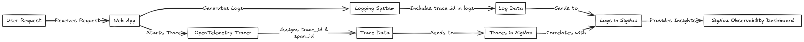
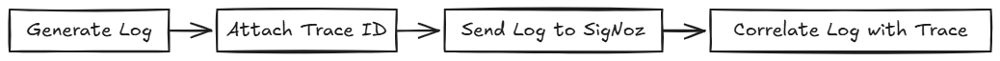
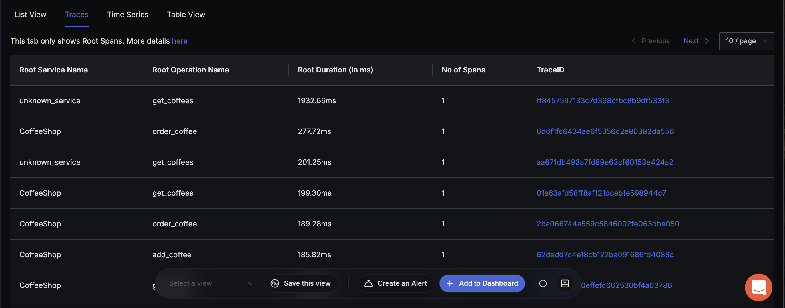
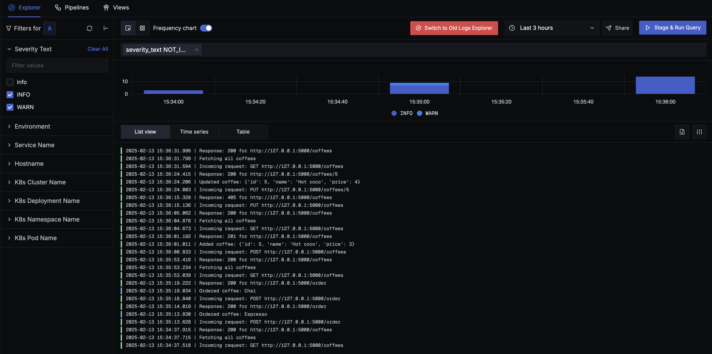
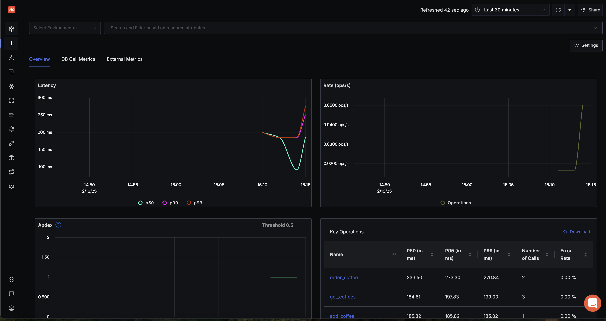

import GetHelp from '@/components/shared/get-help.md'

# Overview

Logs and traces provide valuable insights into an app's performance. While logs capture event details with timestamps, traces track a request’s journey across different components, highlighting latency and bottlenecks. 
Linking logs and traces using a common trace ID helps you pinpoint issues, analyze failures, and optimize performance. This guide focuses on how to link logs and traces. 



## Prerequisite

Ensure you have the following:

* A running app.
* A SigNoz Cloud account or a self-hosted SigNoz instance.
* OpenTelemetry SDK or agent configured for your API framework.

## Configure OpenTelemetry

Set the following environment variables in your development environment:

```
SET SERVICE_NAME = "<your-service-name>"
SET EXPORTER_ENDPOINT = "<observability_platform_endpoint>"
SET EXPORTER_HEADERS = "<authentication_headers>"
SET EXPORTER_PROTOCOL = "grpc"
```
These settings ensure that traces and logs are correctly exported to your observability backend.

## Generate traces

To trace a request from start to finish, you need to generate spans for each operation. OpenTelemetry provides automatic instrumentation for various frameworks.

Follow these steps to generate traces:  

1. Initialize a tracing provider for your application.
1. Create a tracer to generate spans.
1. Attach metadata, such as , HTTP method, user ID.
1. Execute request processing inside the span.
1. Mark span status as successful or failed.
1. Export spans to SigNoz for analysis.

Consider the pseudocode below:

```
FUNCTION initializeTracing():
    CREATE tracer_provider
    SET tracer = get_tracer(SERVICE_NAME)
    SET exporter = create_exporter(EXPORTER_ENDPOINT)
    ADD exporter TO tracer_provider
    SET global tracer_provider TO tracer_provider

FUNCTION trackRequest(request):
    START span "process_request"
    ADD ATTRIBUTE to span: method = request.method
    EXECUTE request processing
    SET span status = OK
    END span
    RETURN response
```

## Generate logs

Logs provide detailed insights at different request execution stages. Include contextual details such as timestamps, severity levels, and message descriptions.

Follow these steps to generate traces:  

1. Log incoming requests before execution.
1. Attach the trace ID to logs for correlation.
1. Process the request and capture execution details.
1. Log response status after execution.

Consider the pseudocode below:

```
FUNCTION logRequest(request):
    SET log_message = "Incoming request: " + request.method + " " + request.url
    LOG log_message WITH TRACE_ID
    SEND log TO SigNoz

FUNCTION logResponse(response):
    SET log_message = "Response: " + response.status + " for " + response.url
    LOG log_message WITH TRACE_ID
    SEND log TO SigNoz
```

### Link logs with traces

To correlate logs with traces, include `trace_id` and `span_id` in the log.

Follow these steps to link logs with traces:

1. Extract trace_id and span_id from the active span.
1. Assign severity levels to logs (INFO, WARN, ERROR, etc.).
1. Create a structured log entry with trace details.
1. Send logs to SigNoz for correlation with traces.



Consider the pseudocode below:

```
FUNCTION sendLogToSigNoz(level, message):
    SET headers = {
        "Authorization": AUTH_KEY,
        "Content-Type": "application/json"
    }

    SET severity_map = {
        "DEBUG": 1, "INFO": 4, "WARN": 8, "ERROR": 16, "CRITICAL": 24
    }

    SET logEntry = {
        "trace_id": get_trace_id(),
        "span_id": get_span_id(),
        "trace_flags": 1,
        "severity_text": level,
        "severity_number": severity_map[level],
        "message": message
    }
```

For example, a log linked with traces would be:


## Configure SigNoz dashboard

To view your app's logs and traces,

1. Go to **Traces** in SigNoz dashboard to verify that traces are sent. You can inspect spans, latency, and different attributes of your trace.
    
1. Go to **Logs** in the SigNoz dashboard to verify that logs are sent. Then, select a log entry to see the correlated trace details.
    
1. You can correlate logs, traces and performance metrics in the Application Performance Monitoring (APM) Dashboard to give you an overall view of API performance. You can view key metrics:
    

By default, OpenTelemetry captures basic metrics, but you can add custom API-level metrics for deeper insights.

## Get Help

<GetHelp />
