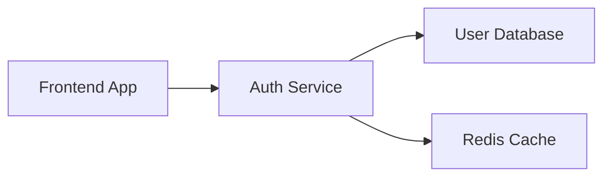

---

title: What is Application Dependency Mapping - A Complete Guide
slug: application-dependency-map
date: 2024-11-20
tags: [monitoring, faq]
authors: [sushant_gaurav]
description: Learn how application dependency mapping helps visualize relationships between applications, services, and infrastructure components for better system management and troubleshooting.
keywords: [application dependency map, dependency mapping, application monitoring, service dependencies, infrastructure mapping, system topology, distributed tracing, application observability]

---

Application Dependency Mapping (ADM) is a process that enables a user to create a detailed visual representation of how various components in an individual’s IT infrastructure interact and connect. It outlines the relationships between applications, services, databases, and other infrastructure elements. Consider it a GPS for your application architecture - it enables you to navigate complex systems and understand the minute effects of changes in one component on the others.

This article helps you learn about ADM in detail along with its types, key components, examples and use cases.

## Understanding Application Dependency Mapping (ADM)

ADM offers a clear view of your system's architecture by identifying and documenting the interconnections between its components. These components are categorized into three primary categories:

- Applications: Frontend services, backend services, and microservices.
- Infrastructure: Physical or virtual servers, containers, and cloud-based resources.
- Network Resources: Load balancers, firewalls, DNS services, and APIs.

### Types of Dependencies in ADM

Let’s look at the types of dependencies in ADM.

- Runtime Dependencies: Direct relationships between active services or processes.
- Configuration Dependencies: Parameters, settings, or environment variables required for functionality.
- Data Flow Dependencies: Pathways illustrating how data moves between systems and services.

### Real-World Analogy: Subway Maps for Applications

ADM is similar to a map of the subway network. Each subway station symbolizes a certain application, service, or database. The lines linking stations represent dependencies such as data transfers and runtime relationships. When one station shuts (equivalent to a failure in an application or service), other routes must adjust, much as your design must manage failures or bottlenecks dynamically.

### Relationship Between ADM and Observability

While ADM offers a static or dynamic overview of dependencies, it enhances observability by providing real-time insights into component interactions, bottlenecks, and failures. Integrating ADM with observability technologies such as distributed tracing increases its value by guaranteeing that your dependency map evolves as your architecture upgrades.

## Key Components of Application Dependencies

Application Dependency Mapping (ADM) works best when you fully understand the components and their interdependence. These can be classified as application-to-application, infrastructure, and network dependencies.

### Application-to-Application Dependencies

Applications frequently interact with other applications to deliver services. These interactions include service calls, shared resources, and API exchanges.

Example: Imagine an e-commerce platform:

- A frontend application requests user authentication from an auth service.
- The auth service fetches user details from a database and caches frequently accessed data for faster responses.

This interaction can be visualized as follows:



Key Aspects:

- Direct Service Calls: A frontend app calls an auth service endpoint like `/api/login`.
- API Endpoints and Contracts: Ensure standardized communication, such as RESTful APIs exchanging JSON data.
- Shared Libraries: Applications using common modules like payment gateways.

### Infrastructure Dependencies

These dependencies reflect the underlying systems and resources that support applications:

- Compute Resources: Servers, virtual machines, containers, or serverless computing like AWS Lambda.
- Storage Systems: Databases, object storage (e.g., S3), and in-memory caches (e.g., Redis or Memcached).
- Cloud Services: Managed cloud resources, such as Amazon RDS, Firebase, or Azure Functions.

Example: In a serverless environment, your infrastructure might include an AWS Lambda function that stores user data in Amazon DynamoDB. A simple AWS Lambda implementation could look like this:

```python
import boto3

def lambda_handler(event, context):
    # DynamoDB client
    dynamodb = boto3.client('dynamodb')

    # Example write operation
    response = dynamodb.put_item(
        TableName='UserTable',
        Item={
            'UserId': {'S': event['user_id']},
            'Name': {'S': event['name']},
        }
    )
    return {"status": "success", "data": response}
```

This illustrates how an application depends on an infrastructure storage system (DynamoDB).

### Network Dependencies

Network dependencies determine how services interact and protect their connections.

Key Elements:

- Ports and Protocols: Services often interact over ports, such as HTTP on port 80 and HTTPS on port 443.
- Load Balancer Configurations: Ensure incoming traffic is efficiently distributed across several instances.
- Network Security Groups: Firewall rules for inbound and outgoing traffic.

Example: A load balancer configuration for an NGINX server:

```
http {
    upstream backend {
        server backend1.example.com;
        server backend2.example.com;
    }

    server {
        listen 80;

        location / {
            proxy_pass <http://backend>;
        }
    }
}
```

This setup distributes traffic to backend servers, showcasing a dependency on the network layer for reliability and scalability.

## Why Application Dependency Mapping Matters

ADM is more than simply a visualization tool; it is a realistic framework for addressing real-world IT difficulties.

### Faster Problem Resolution

ADM enables IT teams to identify the cause of problems and their possible consequences. 

Example: Assume a service interruption happens in an online booking system. Visualizing dependencies allows you to rapidly identify the source of the problem, such as a misconfigured database or a sluggish API.

- Using ADM, you can observe that Service A relies on Database X, which generates the bottleneck.
- Without ADM, troubleshooting entails guessing, which increases resolution time.

### Improves Change Management

ADM lowers the risk of implementing modifications by identifying all affected components.

Example Scenario: Before updating a database version, an ADM tool determines which services rely on it. To avoid interruptions, the team assures backward compatibility or prepares downtime beforehand.

Code Snippet for Testing Compatibility:

```sql
-- Check if the new column addition affects existing queries
EXPLAIN SELECT * FROM orders WHERE status = 'pending';
```

ADM ensures such tests are targeted and effective by providing a dependency map of affected services.

### Enables Cloud Migration

ADM is invaluable for cloud migration strategies:

- Current State Mapping: Identify all on-premises dependencies before migrating them to the cloud.
- Phase-by-Phase Planning: Group interconnected services to ensure a seamless transition.
- Dependency Validation: Use ADM to check if all services have been correctly deployed in the cloud.

Example Workflow for AWS Migration:

```bash
# Use AWS Application Discovery Service for mapping dependencies
aws discovery start-continuous-export --region us-east-1

# Retrieve collected data for analysis
aws discovery describe-continuous-exports
```

ADM visualizes the exported data, ensuring nothing critical is left behind during migration.

## How Application Dependency Mapping Works

Application Dependency Mapping (ADM) takes a systematic method that begins with discovery and progresses to data gathering and visualization.

### Discovery Methods

- Agent-based Discovery: This strategy involves installing specialized agents on servers or services to get precise information about dependencies.
    - Advantages:
        - Very accurate and thorough data.
        - Details about runtime settings, resource use, and direct service calls.
    - Challenges:
        - Requires software installation and maintenance.
        - This may influence system performance in high-load scenarios.
    - Example Use Case: A financial services company uses agent-based tools like Dynatrace to monitor its microservices dependencies and detect anomalies in real-time
- Agentless Discovery: This method analyzes network traffic and logs to infer dependencies without installing additional software.
    - Advantages:
        - Non-intrusive and easy to implement.
        - Ideal for environments with strict security policies.
    - Challenges:
        - Deeper runtime dependencies refer to the intricate relationships and interactions within the application that occur during its execution. For example, agentless methods might fail to capture how specific functions, libraries, or frameworks interact under certain conditions, such as database query optimizations, dynamic API calls, or runtime-generated code paths. This lack of detail can lead to gaps in understanding performance bottlenecks or diagnosing critical issues.
        - Agentless discovery primarily relies on external observations like network traffic and log analysis, which provide surface-level insights. It cannot directly inspect the inner workings of the application, such as thread-level operations, resource allocation patterns, or application-specific logic flow, which are critical for comprehensive dependency mapping in complex systems.
    - Example Use Case: A company preparing for a cloud migration uses AWS Application Discovery Service to identify its network-level dependencies without disturbing its current environment.

### Data Collection Process

Once dependencies have been discovered, data must be collected and structured to produce reliable maps. This approach frequently uses tracing and monitoring frameworks such as OpenTelemetry.

An Example of Dependency Data Collection: The code sample below demonstrates how OpenTelemetry may track service calls and collect dependency information.

File Name: `app.py`

```python
from opentelemetry import trace
from opentelemetry.trace import Status, StatusCode

# Create a tracer instance
tracer = trace.get_tracer(__name__)

@tracer.start_as_current_span("process_order")
def process_order(order_id):
    with tracer.start_span("validate_order") as span:
        # Example validation logic
        span.set_attribute("order.id", order_id)
        if not validate(order_id):
            span.set_status(Status(StatusCode.ERROR, "Invalid order"))
        else:
            span.set_status(Status(StatusCode.OK, "Order processed successfully"))
```

In this example:

- Tracer: Captures the flow of operations (e.g., `process_order`).
- Span Attributes: Annotate spans with metadata, such as the `order_id`.
- Status Codes: Mark spans as successful or erroneous to aid troubleshooting.

This tracing data can be visualized in tools like SigNoz to generate a dependency map.

## Best Practices for Implementing ADM

Effective implementation of ADM requires a strategic approach to ensure accuracy, scalability, and usability.

### 1. Start Small

Begin by mapping critical applications and services first.

Steps to Start Small:

- Determine high-priority services based on business effect.
- Specify the scope of dependencies to map, such as runtime interactions only.
- Use tools like OpenTelemetry to do selective tracing.

Example Workflow:

```bash
# Initialize tracing for a specific service
opentelemetry-instrument --service-name my-critical-service python app.py
```

This approach avoids overwhelming your team with excessive data and focuses on actionable insights.

### 2. Maintain Accuracy

Dependency maps should reflect the current state of your systems.

Tips for Accuracy:

- Automate Discovery: Use tools that automatically detect and update dependencies.
- Regular Updates: Schedule periodic reviews of dependency data to identify stale connections.
- Validate Periodically: Cross-check maps with operational logs and performance metrics.

Example Automation Command: With tools like AWS Application Discovery, automate the export of dependency data:

```bash
aws discovery start-continuous-export --region us-east-1
```

### 3. Integration Strategy

Ensure that ADM fits seamlessly into your existing processes.

Key Strategies:

- Tool Integration: Connect ADM tools with monitoring platforms like SigNoz or Prometheus for unified insights.
- Standardized Data Formats: Use formats like JSON or YAML to share the maps across teams.
- Automated Updates: Configure workflows that trigger dependency updates based on CI/CD pipelines.

Example YAML Configuration:

```yaml
dependencies:
  - service: frontend-app
    depends_on:
      - auth-service
      - cache
  - service: auth-service
    depends_on:
      - user-database
```

Following these guidelines allows teams to design actionable and scalable dependency maps that support efficient IT operations and development workflows.

## Monitoring Dependencies with SigNoz

[SigNoz](https://signoz.io/) is a reliable observability platform that employs distributed tracing to provide detailed application dependency maps. Its capabilities enable DevOps teams to better view, evaluate, and monitor dependencies.

### 1. Setup Process

To get started with SigNoz

<GetStartedSigNoz />

After installation, the SigNoz UI becomes accessible, providing tools for monitoring traces and metrics.

### 2. Configure Applications

Once SigNoz is set up, the next step is instrumenting your applications using OpenTelemetry.

- Adding Instrumentation: Inject OpenTelemetry libraries into your application to capture trace data.
- Example: Instrumenting a Python application:
    
    ```bash
    opentelemetry-bootstrap -a install
    opentelemetry-instrument \\
        --traces_exporter otlp \\
        --service_name=my-service \\
        python app.py
    ```
    
- Set Sampling Rates: Configure how much trace data to sample to balance performance with observability.
    - Example configuration snippet for a tracing YAML:
        
        ```yaml
        otel:
          sampling:
            rate: 0.5  # Sample 50% of traces
        ```
        
- Define Service Names: Ensure each service in your system has a unique, descriptive name to improve map readability.

### 3. View Dependencies

SigNoz allows you to assess your system's dependencies using visual service maps.

- Access Service Maps: To examine how services interact, navigate to the "Service Map" area of the SigNoz dashboard.
- Analyze Trace Data: Examine individual traces to find bottlenecks and delay concerns.
- Monitor Performance Metrics: Use metrics such as request time and error rates to evaluate dependence health.

These capabilities enable teams to proactively solve performance issues and simplify processes.

## Key Takeaways

- Application Dependency Mapping (ADM) creates a comprehensive visual representation of IT components, revealing interconnections between applications, infrastructure, and network resources.
- ADM is likened to a subway map, clarifying dependencies and enabling adjustments during failures or changes.
- Types of dependencies include runtime, configuration, and data flow, showcasing how services interact dynamically.
- ADM enhances observability by integrating with tools like distributed tracing for real-time insights into system performance.
- Examples like frontend apps interacting with authentication services and databases illustrate application-to-application dependencies.
- Infrastructure dependencies highlight reliance on compute resources, storage systems, and cloud services like AWS Lambda or DynamoDB.
- Network dependencies ensure reliable service interaction through secure configurations like load balancers and firewall rules.
- Tools such as SigNoz and OpenTelemetry automate ADM processes, offering visual maps for proactive performance monitoring and troubleshooting.

## FAQs

### What’s the difference between static and dynamic dependency mapping?

- Static Dependency Mapping: Represents predefined, documented interactions between components, often based on configuration files or design documents.Example: A YAML file specifying which services rely on specific databases.
- Dynamic Dependency Mapping: Illustrates real-time, runtime interactions by analyzing actual calls and resource utilization during operations.Example: SigNoz tracing data uncovering unexpected API calls between services.

### How frequently should dependency maps be updated?

You should update dependency maps should in the following scenarios:

- Major Releases: When launching new services or significantly modifying existing ones.
- Architecture Changes: During transitions like migrating to microservices or moving to the cloud.
- Scheduled Reviews: Periodically (e.g., quarterly) to ensure accurate maps.

Best Practice: Leverage automated discovery tools, such as SigNoz, to maintain up-to-date dependency maps effortlessly.

### Can ADM work in containerized environments?

Yes, ADM (Application Dependency Mapping) is compatible with containerized environments like Kubernetes. These environments pose unique challenges due to their ephemeral nature.

Challenges:

- Rapid scaling and orchestration increase complexity.Solution:
- Use OpenTelemetry to monitor Kubernetes services.
- Pair it with SigNoz to visualize service interactions and manage container churn effectively.

### What are the common challenges in implementing ADM?

1. Rapidly changing dependencies in modern systems.Solution: Implement continuous monitoring and automated discovery tools.
2. Lack of native support in legacy systems.Solution: Use a combination of manual mapping and modern ADM tools.
3. Maintaining accuracy for effective troubleshooting.Solution: Schedule regular updates and automate data collection processes.
4. Potential performance overhead from monitoring.Solution: Optimize sample rates and focus on critical pathways to minimize impact.