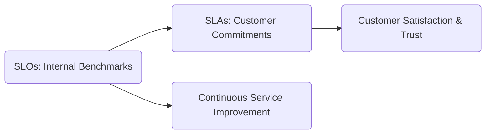
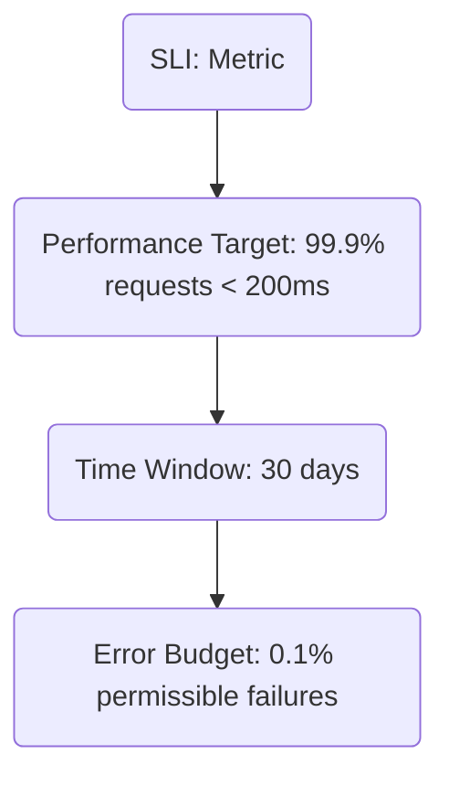
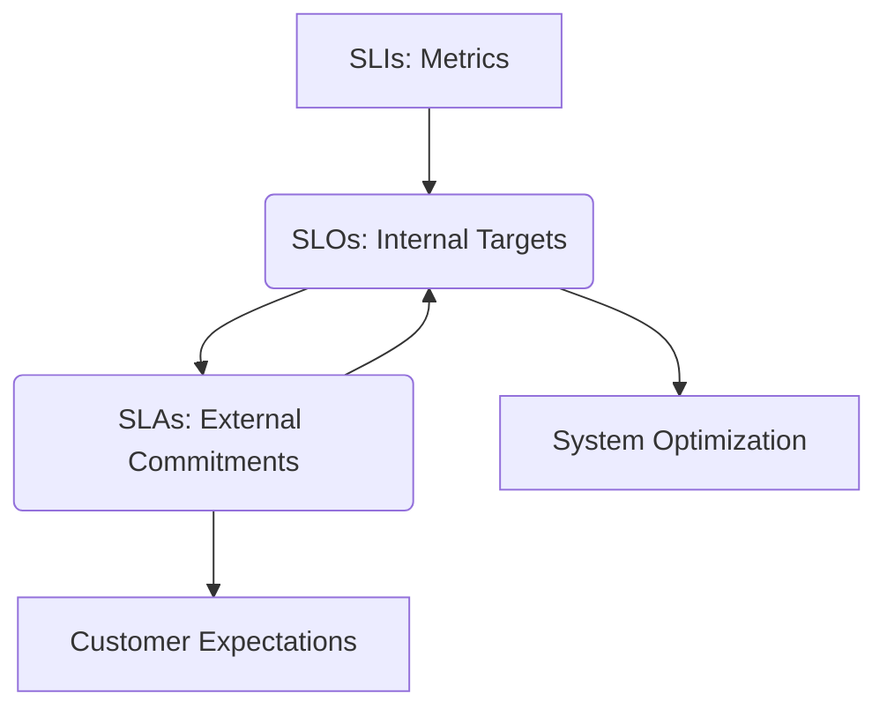

---

title: SLO vs SLA - Key Differences for Service Management
slug: slo-vs-sla
date: 2024-11-20
tags: [monitoring]
authors: [sushant_gaurav]
description: Explore the crucial differences between SLOs and SLAs in service management. Learn how to implement and balance these metrics for optimal performance.
keywords: [slo vs sla, service level objectives, service level agreements, service management, performance metrics, it operations]

---

In modern service management, Service Level Objectives (SLOs) and Service Level Agreements (SLAs) provide a core framework for establishing, measuring, and sustaining service quality. These notions govern service delivery and guarantee that technical teams and consumer expectations are aligned.

But what distinguishes them? How do they complement one another to ensure constant and dependable service? Let's explore these key components further.

## Understanding SLOs and SLAs: The Basis for Service Management

SLOs or Service Level Objectives and SLAs or Service Level Agreements have the same purpose of setting service standards, but their focus and scope vary considerably. Let’s learn about both of them for more clarity.

### What Are Service Level Objectives (SLOs)?

SLOs are internal performance benchmarks established by a service provider to evaluate the quality and dependability of its systems. These goals enable technical teams to monitor and optimize the service's performance.

Typical SLO metrics include:

- System Uptime: It ensures the service is available, such as "99.9% availability."
- Response Time: It means how quickly queries are executed, such as "API latency < 200ms."
- Error Rates: The percentage of unsuccessful requests, such as "Error rate < 1%."
- Request Throughput: It is the number of completed requests per second.

Example: A streaming service like Netflix might define an SLO to ensure buffering time is under 3 seconds for 99% of users.

### What Are Service Level Agreements (SLAs)?

SLAs, on the other hand, are external, legally binding commitments given to consumers. They specify the quality of service that consumers may anticipate and contain fines or compensation for non-compliance.

Typical SLA terms include:

- Guaranteed Uptime: E.g., "Service availability of 99.95% per month."
- Support Response Times: E.g., "Critical issues addressed within 1 hour."
- Performance Benchmarks: E.g., "Database query time < 500ms."
- Compensation Policies: Refunds or credits if service expectations aren't met.

Example: An SLA for a cloud provider like AWS may promise 99.99% availability for its EC2 instances, with compensation (e.g., service credits) in the event of downtime.

### How SLOs and SLAs Integrate

Let us now see how SLOs and SLAs can be integrated.

- SLOs complement SLAs by ensuring that internal teams' performance expectations are consistent with customer obligations.
- SLAs rely on SLOs to define attainable commitments while avoiding over-committing resources.

Visual Representation:



### Why Are SLOs and SLAs Important in Modern IT?

Both SLOs and SLAs play critical roles in assuring service quality and operational efficiency. Let’s now look at the reasons why SLOs and SLAs are important in modern IT.

1. Setting Clear Expectations: It assists in aligning what consumers desire with what the provider can give.
2. Bridging Business and Technical Goals: SLOs link technical performance with business results.
3. Continuous Improvement Framework: It establishes benchmarks for iterative improvement.
4. Increasing Customer Trust: Clear, quantifiable pledges boost dependability and customer happiness.

By properly establishing and monitoring SLOs and SLAs, firms can maintain a balance between operational excellence and customer satisfaction, making them essential for every service-oriented business.

## The Anatomy of an SLO: Setting Internal Performance Goals

Crafting an Effective Understanding of the fundamental components of Service Level Objectives (SLOs) is necessary. Each component of a SLO guarantees that it is quantifiable, actionable, and in line with operational objectives.

### Key Components of an SLO

Understanding the fundamental components of Service Level Objectives (SLOs) is essential for ensuring their effectiveness. Each part of an SLO must be clear, measurable, and aligned with your operational goals to track and enhance service reliability. Let’s now look at the key components of an SLO.

1. Service Level Indicator (SLI)
    
    A Service Level Indicator (SLI) is the specific metric used to measure the performance of a service. Common SLIs include metrics like latency (response time), uptime (availability), and error rates (reliability issues).
    
    SLIs play a crucial role in bridging the gap between service performance and SLOs by quantifying the user’s experience. For instance, if users often complain about slow application response times, latency might be chosen as the key SLI. By monitoring this metric, organizations gain actionable insights into areas for improvement.
    
    How SLIs Measure SLOs:
    
    SLIs are the foundation of SLOs, as they provide the measurable data necessary to assess whether a service is meeting its goals. The better the quality and relevance of the SLI chosen, the more accurately it reflects the actual performance experienced by users.
    
    Example SLI: The percentage of API requests completed within 200 milliseconds. This metric captures both speed and reliability in real-world conditions.
    
    When setting SLIs, it is important to:
    
    - Focus on what matters most to your users (e.g., response time for an API or uptime for a website).
    - Use reliable tools for measuring the SLI, such as observability platforms or logs.
    - Ensure the SLI is simple to understand and easy to track.
2. Performance Target: This is the desired level of performance you aim to achieve. For example, "99.9% of requests must be completed within 200 milliseconds." The performance target specifies what “good enough” means for your service and sets a clear expectation for teams and stakeholders.
3. Time Window: The time window is the duration over which the SLI is measured. Common windows include a rolling 30-day period or a calendar month. Defining the time window ensures consistency in evaluation and accountability.
4. Error Budget: The error budget represents the permissible amount of failure or deviation from the target before corrective measures are taken. For example, with a 99.9% target, your error budget is the remaining 0.1%—meaning 0.1% of requests can take longer than 200 milliseconds.

### Setting Realistic and Achievable SLO Targets

To ensure SLOs are practical and effective, the targets must be realistic, measurable, and achievable. Let’s look at some guidelines:

- Understand Baseline Performance: Before setting a target, analyze historical performance data. If your service currently completes 98% of requests within 200 milliseconds, a target of 99.9% may not be realistic without significant improvements.
- Prioritize User Needs: Identify what aspects of performance are most important to your users. For instance, in a video streaming platform, users might prioritize streaming quality (low buffering) over quick page load times.
- Start with Conservative Targets: It’s better to start with achievable targets and raise them gradually as your infrastructure and processes improve.
- Involve Stakeholders: Collaborate with engineering, operations, and business teams to align SLO targets with organizational goals and resource availability.
- Review Regularly: Periodically revisit your SLOs and SLIs to ensure they still align with user expectations and technical capabilities.

Example SLO:

```
The API will respond to 99.9% of requests within 200ms over a 30-day rolling window.
```

In the above example:

- SLI is the API response time
- Performance Target: 99.9% of requests within 200ms
- Time Window: 30-day rolling period
- Error Budget: 0.1% of requests can exceed 200ms

### Visualizing SLO Components

Let’s look at a diagram that illustrates these elements:



### Implementing Effective SLOs

Let’s now look at the steps to create actionable SLOs, along with explanations of why each step is important and how they contribute to long-term success: 

1. Identify Key Services and User Journeys: You should begin by prioritizing the critical services and user interactions that directly affect customer satisfaction, such as login functionality or payment processing.
    - Why This Matters: Focusing on these key areas ensures that your SLOs address the most impactful aspects of your service. For example, slow checkout processing in an e-commerce platform can lead to abandoned carts, negatively affecting both revenue and user trust.
    - How to Do It:
        - Map user journeys to understand the critical touchpoints (e.g., checkout, search functionality).
        - Use data from analytics or customer feedback to identify services with the highest user impact.
2. Define Relevant SLIs: You should choose Service Level Indicators (SLIs) that closely represent the user experience, such as page load times, error rates, or latency.
    - Why This Matters: An irrelevant or poorly chosen SLI may not accurately reflect what users care about, leading to misaligned efforts. For example, measuring uptime alone might overlook performance issues like slow page loads.
    - How to Do It:
        - Ensure the chosen SLI aligns with your business goals. For instance, a fast-loading homepage directly supports an e-commerce business’s objective to boost user engagement.
        - Test the measurability of the SLI to ensure it can be tracked consistently.
3. Set Realistic Targets: You should balance ambition with system capabilities by defining achievable performance levels. For example, rather than aiming for 100% availability, a more realistic target could be 99.95% uptime.
    - Why This Matters: Unrealistic targets can demoralize teams and lead to overpromised service levels that are ultimately unsustainable. On the other hand, a target that is too lenient fails to challenge the system, missing opportunities for improvement.
    - How to Do It:
        - Assess historical performance data to set achievable benchmarks.
        - Start with a conservative target and raise it incrementally based on system improvements.
4. Align SLOs with Business Objectives: You must ensure that your SLOs are directly tied to your company’s strategic goals. For example, if a streaming platform's goal is to increase user retention, an SLO focused on buffering time or playback interruptions would be ideal.
    - Why This Matters: When SLOs are aligned with business goals, they become a tool for both technical teams and leadership to work toward shared priorities. Misaligned SLOs can result in wasted resources and efforts on metrics that don’t impact the bottom line.
    - How to Do It:
        - Collaborate with stakeholders to understand how service performance influences business KPIs.
        - Regularly communicate how SLOs contribute to achieving broader objectives.
5. Involve Stakeholders: You should work closely with technical, product, and business teams to define and maintain SLOs.
    - Why This Matters: Cross-team collaboration ensures that SLOs are practical, achievable, and aligned with the needs of both users and the business. For instance, developers may provide insights into technical feasibility, while product teams can highlight user priorities.
    - How to Do It:
        - Organize workshops or meetings with representatives from all relevant teams.
        - Clearly define roles and responsibilities for monitoring and revising SLOs.
6. Monitor Proactively: You should use robust monitoring tools such as [SigNoz](https://signoz.io/) to track SLO metrics and detect anomalies in real-time.
    - Why This Matters: Proactive monitoring helps identify potential issues before they escalate, minimizing downtime and preserving user satisfaction. For example, detecting a rise in latency during high-traffic periods allows teams to act before it affects users.
    - How to Do It:
        - Set up alerts for metrics that deviate from defined thresholds.
        - Use dashboards to visualize trends and track historical performance.
7. Review and Iterate Regularly: You should periodically evaluate and update your SLOs to reflect changes in your service or evolving user expectations.
    - Why This Matters: A static SLO can quickly become irrelevant as user needs and business priorities shift. Continuous improvement ensures that your SLOs remain both relevant and effective.
    - How to Do It:
        - Conduct quarterly or biannual reviews to assess whether the SLOs are still aligned with business goals.
        - Use incident data to identify areas for adjustment or improvement.

### Tips for Continuous Improvement of SLOs

1. Learn from Incidents: After every incident, analyze the root cause and evaluate whether the SLO needs adjustment.
2. Incorporate User Feedback: Regularly gather feedback from users to understand their expectations and frustrations.
3. Benchmark Against Industry Standards: Compare your SLOs to competitors or industry leaders to identify opportunities for improvement.
4. Leverage Automation: Use automation tools to streamline SLO monitoring and reporting, allowing teams to focus on optimization instead of manual checks.

Example:

For an e-commerce platform during Black Friday, a well-defined SLO might state:

"99.95% of checkout requests will be processed within 500ms during peak traffic periods."

## Dissecting SLAs: Customer Commitments and Legal Implications

Service Level Agreements (SLAs) turn internal SLOs into customer-facing promises. They outline the service assurances, incorporate accountability methods, and frequently impose legal and financial penalties for noncompliance.

### Key Components of an SLA

Let us now look at the various key components of an SLA

- Service Description: This section outlines what services will be delivered, including a detailed explanation of the features and functionalities offered. It ensures clarity on what the customer can expect.
- Performance Metrics: These are measurable targets that define the service quality, such as:
    - Uptime: The percentage of time the service remains operational.
    - Response Time: How quickly the provider acknowledges issues.
    - Resolution Time: The time taken to fix problems.
- Responsibilities: It specifies the roles and obligations of both the service provider and the customer. For example:
    - The provider may handle system maintenance and updates.
    - The client may need to report issues promptly or maintain their end of the infrastructure.
- Penalties and Remedies: It defines what happens if the agreed performance standards are not met. This could include:
    - Service Credits: Compensation like extended service periods.
    - Reimbursements: Refunds for certain failures.
- Exclusions: It lists situations where the SLA does not apply, such as:
    - Natural Disasters: Events like earthquakes or floods.
    - Scheduled Maintenance: Pre-planned downtime for updates or repairs.

Example SLA Metric:

```
The service will be available 99.95% of the time, measured monthly. Any downtime exceeding this will result in service credits of 10% of the monthly fee for each 0.1% below the target.
```

### Crafting Robust SLAs

Let’s now take a look at the things that you should keep in mind to create a robust SLA.

1. Be Specific and Measurable: You should use exact measures that do not allow for ambiguity.
    - For example, "Critical tickets will be resolved within 4 hours" is more effective than "Issues will be resolved quickly".
2. Set Realistic Expectations: You must not over-promise. SLA terms should be based on attainable SLOs, with a buffer for unanticipated difficulties.
3. Include Review Processes: You should schedule frequent SLA reviews to accommodate changing demands or infrastructure.
4. Define Communication Channels: You should establish a clear escalation mechanism for reporting and resolving concerns.
5. Incorporate Flexibility: You should allow for scheduled outages or maintenance windows.

Pro Tip: Always set SLA objectives slightly lower than internal SLOs to account for unanticipated disruptions.

### Legal and Financial Implications of SLAs

Breaching an SLA can have serious consequences, let’s now look at such consequences:

- Financial Penalties: Refunds or credits for the affected period.
- Contract Termination: If repeated breaches occur.
- Reputation Damage: Loss of trust can hurt customer retention.
For example, if an SLA claims 99.9% uptime but the actual uptime is 99.7%, the service provider may owe the customer service credits for the difference.

Example: If an SLA claims 99.9% uptime but the actual uptime is 99.7%, the service provider may owe the customer service credits for the difference.

### Practical Example

For example, a cloud hosting firm may promise 99.99% monthly uptime. If downtime exceeds this limit, clients will get 5% service credit for each consecutive hour of downtime.

This promise promotes responsibility while motivating the supplier to reduce downtime.

## SLO versus SLA: Key Differences and Interdependencies

Although Service Level Objectives (SLOs) and Service Level Agreements (SLAs) are related, they serve distinct functions. Let's look at their differences and how they complement each other.

### Key Differences Between SLOs and SLAs

So far we have learnt what are SLOs and SLAs. So, let’s now compare them side by side for more clarity.

1. Focus:
    - SLOs: It is internal performance benchmarks focused on operational efficiency.
    - SLAs: It is a customer-facing commitment that ensures service reliability.
2. Stakeholders:
    - SLOs: It primarily concerns internal teams like engineering and operations.
    - SLAs: It involves both service providers and customers, often including legal teams.
3. Flexibility:
    - SLOs: It is easier to modify based on internal factors, such as changing business priorities.
    - SLAs: It requires formal renegotiation, often involving legal processes.
4. Consequences of Non-Compliance:
    - SLOs: It has internal repercussions, such as initiating reviews and corrective measures.
    - SLAs: It has external consequences like financial penalties, service credits, or reputational harm.
5. Metrics:
    - SLOs: It is typically more granular and technical, focusing on backend metrics like API latency.
    - SLAs: It is broad and customer-centric, emphasizing high-level metrics like uptime.
6. Enforcement:
    - SLOs: It is monitored internally without legal obligations.
    - SLAs: It is legally enforceable, with specific remedies outlined for breaches.
7. Timeframe:
    - SLOs: It is more short-term and adaptable to changing operational needs.
    - SLAs: It is aligned with contractual agreements, typically long-term.
8. Purpose:
    - SLOs: It helps to guide internal teams in maintaining and improving system performance.
    - SLAs: It provides formal assurances to customers regarding service quality.

| Aspect | SLOs (Service Level Objectives) | SLAs (Service Level Agreements) |
| --- | --- | --- |
| Focus | Internal performance benchmarks focused on operational efficiency. | Customer-facing commitments ensuring service reliability. |
| Stakeholders | Primarily concern internal teams like engineering and operations. | Involve service providers, customers, and often legal teams. |
| Flexibility | Easier to modify based on internal factors (e.g., business priorities). | Require formal renegotiation, often involving legal processes. |
| Consequences of Non-Compliance | Internal repercussions, such as reviews and corrective measures. | External consequences like financial penalties or service credits. |
| Metrics | More granular and technical, focusing on backend metrics (e.g., API latency). | Broad, customer-centric metrics like uptime. |
| Enforcement | Monitored internally with no legal obligations. | Legally enforceable with clear remedies for breaches. |
| Timeframe | Typically short-term, adaptable to changing operational needs. | Long-term, aligned with contractual periods. |
| Purpose | Guides internal teams to maintain and improve system performance. | Provides a formal assurance of service quality to customers. |

### The Interrelationship Between SLOs and SLAs

SLOs and SLAs are different but they are closely linked, let’s check out how!

- SLOs as the Basis for SLAs: Internal objectives inform realistic customer commitments.
- SLAs Guide SLO Refinements: Customer expectations drive the optimization of internal goals.
- Shared Foundation: Both rely on Service Level Indicators (SLIs) for tracking and measurement.

Diagram of SLO-SLA Relationship:



## The Role of SLIs in SLO and SLA Management

Service Level Indicators (SLIs) are measurable metrics forming the backbone of SLOs and SLAs. These indicators bridge the gap between system performance and user experience.

### Common SLIs

- Latency: Time taken for a response (e.g., time to the first byte or time to interact).
- Availability: Percentage of successful requests.
- Error Rate: Proportion of failed requests (e.g., 5xx errors).
- Throughput: Volume of requests handled per second.

### Effective SLI Implementation

1. Relevance: Select SLIs that directly impact user satisfaction.
2. Consistency: Ensure SLIs are measurable across the entire infrastructure.
3. Diversity: Use multiple SLIs for a holistic view of system health.
4. Monitoring: Employ real-time tracking tools like SigNoz or Prometheus for actionable insights.

Example:

For an e-commerce platform, suitable SLIs might include:

- Homepage load time.
- Search query response time.
- Checkout process success rate.
- Order confirmation email delivery time.

By monitoring these SLIs, teams can pinpoint bottlenecks and optimize performance.

## Balancing SLOs and SLAs for Optimal Service Management

Finding the equilibrium between internal goals (SLOs) and external promises (SLAs) is key to maintaining trust and efficiency.

### Strategies for Alignment

1. Use SLOs to Inform SLAs: Set SLOs slightly higher than SLA commitments to create a buffer.
    - Example: If your SLA guarantees 99.9% uptime, set your SLO at 99.95%.
2. Incorporate Error Budgets: Define acceptable failure thresholds to balance innovation and reliability.
    - Example: Allocate 0.1% of uptime for maintenance or unexpected issues.
3. Align Metrics: Ensure internal metrics (SLOs) are directly translatable to customer-facing terms (SLAs).
4. Continuous Improvement: Use SLO performance data to adjust SLAs, ensuring customer needs are met.
5. Transparent Communication: Regularly inform customers about SLA performance to build trust and manage expectations.

### Error Budget Example

Scenario: Your SLA promises 99.9% availability (approximately 8.76 hours of allowable downtime annually). Internally, you set an SLO of 99.95%, reducing allowable downtime to 4.38 hours annually.

This buffer allows for:

- Planned maintenance.
- Quick recovery from unforeseen outages.
- Flexibility in deploying new features without SLA breaches.

## Monitoring and Reporting: Ensuring SLO and SLA Compliance

Monitoring and reporting play a critical role in maintaining SLO and SLA compliance. A robust monitoring strategy not only ensures adherence but also helps in proactively addressing potential issues.

### Key Practices for Monitoring and Reporting

1. Real-Time Monitoring: Use tools to gain instant visibility into service performance, enabling quick identification of issues.
2. Comprehensive Dashboards: Create visual dashboards that track SLIs, SLOs, and SLA compliance metrics in real-time.
3. Automated Alerts: Set up alerting systems that notify teams about potential SLO breaches or SLA violations before they escalate.
4. Regular Reporting: Share periodic performance reports with both internal teams and external stakeholders to maintain transparency.
5. Trend Analysis: Leverage historical data to detect performance patterns, predict future trends, and optimize service delivery.

### Utilizing SigNoz for Effective SLO and SLA Management

[SigNoz](https://signoz.io/) provides a comprehensive platform to streamline SLO and SLA management, offering advanced capabilities for tracking, visualization, and alerting.

### Key Features of SigNoz

1. Real-Time SLI Tracking: Monitor key service indicators across your infrastructure.
2. Custom SLO Definition: Define and track objectives tailored to specific services.
3. Automated Alerting: Receive alerts well before SLO breaches occur, enabling proactive responses.
4. Detailed Dashboards: Visualize service health, SLA compliance, and error budgets.
5. Error Budget Management: Allocate and monitor error budgets to balance reliability with innovation.

### How to Set Up SLO Tracking in SigNoz Cloud

1. Sign Up: First, create a SigNoz cloud account.
<GetStartedSigNoz />
2. Install the Agent: After creating an account, you can deploy the SigNoz agent on your servers or containers.
3. Define SLIs and SLOs: Configure performance indicators and objectives in the SigNoz dashboard.
4. Configure Alerts: Set up automated alerts to notify teams about potential risks.
5. Generate Reports: Use built-in tools to create and share performance reports with stakeholders.

For self-hosting enthusiasts: SigNoz also offers an open-source version with similar capabilities, ideal for organizations with specific hosting requirements.

## Common Challenges in SLO and SLA Implementation

While SLOs and SLAs are powerful tools for service management, their implementation can pose several challenges. Below are common issues and actionable solutions:

1. Setting Realistic Targets: Balancing ambitious goals with achievable performance.
    - *Solution*: Begin with conservative targets informed by historical data and refine them over time.
2. Aligning Metrics with Business Outcomes: Bridging the gap between technical metrics and business impact.
    - *Solution*: Collaborate with business stakeholders to identify the metrics that matter most to them.
3. Ensuring Data Accuracy: Maintaining consistent and reliable SLI measurements across systems.
    - *Solution*: Standardize monitoring processes and invest in robust tools for accurate tracking.
4. Managing Customer Expectations: Effectively communicating performance metrics to customers.
    - *Solution*: Educate customers on SLA metrics, provide transparent updates, and set realistic expectations.
5. Adapting to Change: Keeping SLOs and SLAs relevant in dynamic environments.
    - *Solution*: Regularly review objectives and agreements, building flexibility into SLA terms where possible.

### Example: Overcoming Challenges in a Dynamic Environment

Consider a SaaS company launching a new feature. The initial SLO for the feature might target 95% availability, with plans to improve as adoption grows. By tracking SLIs and analyzing trends, the company can adjust its SLOs and ensure that external SLAs remain unaffected during the transition.

This approach not only maintains service reliability but also supports innovation without risking customer trust.

## Future Trends in Service Level Management

As service level management evolves, staying ahead of emerging trends is critical for firms seeking to preserve a competitive edge and satisfy customer expectations. Key developments to monitor include:

1. AI-Driven SLO Optimization: Machine learning algorithms are increasingly being utilized to forecast possible SLO violations and offer preventative steps, resulting in more effective service management.
2. User-Centric SLAs: A preference for user experience measurements, such as response times and satisfaction scores, above strictly technical performance indicators.
3. Dynamic SLAs: Flexible agreements that adjust in real-time to changing conditions, user behaviour, or infrastructure limits, assuring relevance and responsiveness.
4. Predictive Analytics: Using historical and real-time data to estimate future service levels and fix issues before they affect customers.
5. Integration with DevOps: Smooth integration of service level management into CI/CD pipelines, enabling rapid deployment without compromising reliability.

### Staying Ahead

Adopting these trends can help firms deliver better service, decrease downtime, and increase customer happiness. Tools like SigNoz will be critical in helping firms embrace these advances and prosper in a rapidly changing service sector.

## Key Takeaways

- SLOs are internal performance criteria, whereas SLAs are external agreements with customers.
- Both SLOs and SLAs rely on SLIs to accurately assess service health and performance.
- Balancing internal objectives (SLOs) and external obligations (SLAs) is crucial for ensuring service quality and dependability.
- Continuous monitoring and iterative enhancements are critical for effective service level management.
- Tools such as SigNoz make it easier and more effective to measure, manage, and optimize service levels.
- Organizations that understand and align SLOs and SLAs may provide outstanding service while retaining operational efficiency.

## FAQs

### What happens if an SLA is breached?

If a service provider violates an SLA, consequences may include service credits, financial compensation, and contract termination rights for the consumer.

The severity of the repercussions is determined by the parameters specified inside the SLA.

### How often should SLOs and SLAs be reviewed?

- SLOs: Review quarterly to ensure alignment with internal performance improvements and operational goals.
- SLAs: Review yearly or on a contractual basis to reflect changes in customer demands, corporate priorities, or industry standards.

### Can a company have SLOs without SLAs?

Companies use SLOs as internal performance targets to drive operational changes, benchmark service quality, and prepare for future external SLAs.

While not every SLO has a matching SLA, establishing strong SLOs creates a solid basis for future customer-facing agreements.

### How do SLOs and SLAs impact customer satisfaction?

SLOs and SLAs improve customer satisfaction by providing explicit and quantifiable expectations for service performance.
2. Providing openness in service delivery to build confidence.
3. Showing a dedication to satisfying consumer demands.
4. Serving as benchmarks for maintaining and exceeding service standards.

Organizations with well-defined and managed SLOs frequently fulfil or exceed their SLA promises, resulting in high levels of customer confidence and loyalty.