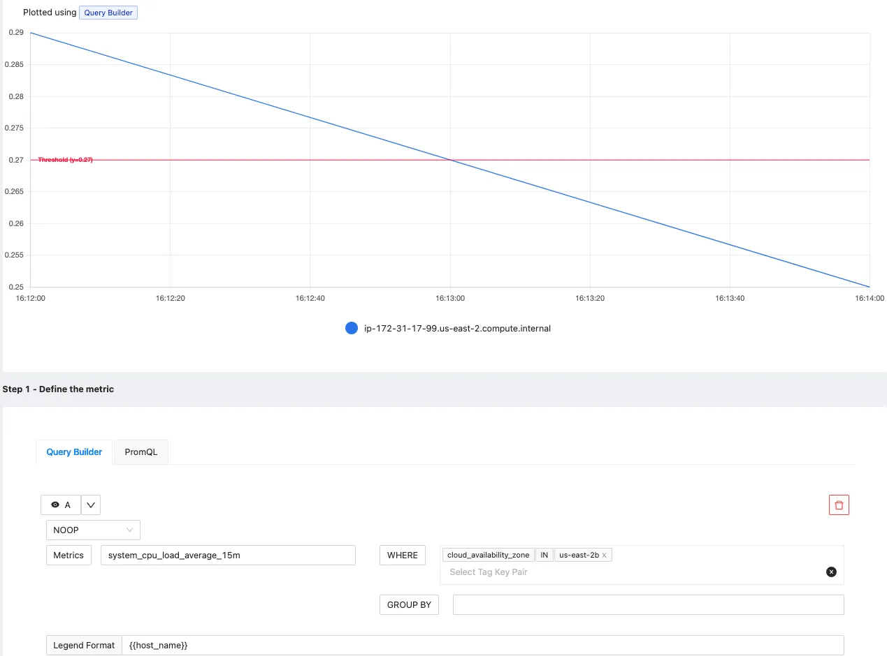
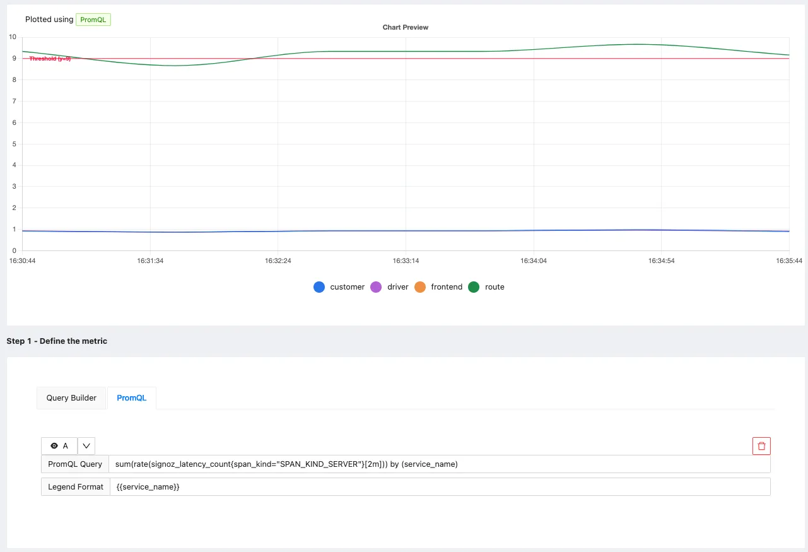

<!-- # Setting alerts in SigNoz  

## Setting Alert Rules

You can set Alert Rules in SigNoz in the following 3 ways:
1. Query Builder - This is DIY way to build alerts by selecting metrics from dropdowns. You can also set filter and group by conditions by selecting options from the dashboard.
2. PromQL - You can use [Prometheus Query Language](https://prometheus.io/docs/prometheus/latest/querying/basics/) to write expressions for alerts which will be evaluated in regular time interval. If you have set up alerts in Prometheus, this method should be very familiar.
3. Clickhouse Queries - You can write clickhouse queries that adhere to the SigNoz data model and format. The result of the query will be used to evaluate alert threshold conditions. Additionally, you can also generate labels and annotations using the results of your query.

Navigate to Alerts page from the left panel. It has 2 tabs:

1. Alert Rules
2. Triggered Alerts

Alert Rules set the expression you want to evaluate to start firing alerts. The Alert Rules tab shows a list of currently configured alert rules and labels like `severity` and `Alert Name`. It also shows the current status of this Alert rules. If any alerts are `firing` because of this or everything is `Ok`

### Steps to Create Alert Rules:

To create new alert rules, you can click the `New Alerts` button. This would open a pane with the type of alerts. 

Choose an appropriate type of alert by clicking on one of the cards. 

On the alert form, you can choose one of the following tabs to define source of your metric. 

1. Query Builder
2. Clickhouse Query
3. PromQL (Available only for metrics)

> Note: Presently the logs, traces and exceptions-based alerts support only Clickhouse Query based metric. 

#### 1. Query Builder
In Query Builder, you can use the dropdowns in the dashboard to select the right metric. 
- Then create an expression with WHERE and GROUPBY clauses which represents the expression to evaluate for alerting
- Threshold which the value of expression should cross ( above or below) to trigger an alert.
- Evaluation period of the expression
- Set name, descriptions and tags about the alert to make it more informative

#### 2. PromQL

In PromQL, you can write the Prometheus expression to evaluate. 

- Set the expression you want to evaluate to trigger alerts. The expression also includes the evaluation interval.
- Threshold which the value of expression should cross ( above or below) to trigger an alert.
- Set labels like `severity` to communicate how severe the issue is if this alert starts firing

#### 3. Writing Clickhouse Queries in Alert form
On `clickhouse query` tab, you will be presented with a query editor with a default query that you can start working with. To learn more about the data-model and query format, read [this tutorial](https://signoz.io/docs/tutorial/writing-clickhouse-queries-in-dashboard/#building-alert-queries-with-clickhouse-data).  

You can use `Run Query` to confirm your query works. Include the bind variables and mandatory column aliases as mentioned [here](https://signoz.io/docs/tutorial/writing-clickhouse-queries-in-dashboard/#building-alert-queries-with-clickhouse-data). 

### Steps to Setup Triggered Alerts

Triggered alerts show the alerts which are in `firing` or `pending` state. 

Pending means that the rule threshold is crossed, but it is still waiting based on the specified time period. Once the specified time is passed, the alert starts firing.

It also has different tags like alert name, severity, since when the alert started firing, etc.

- Filtering and grouping Triggered alerts

You can also filter and group triggered alerts based on tags. The filtering field accepts multiple key-value pairs like `serverity:warning`

For grouping, you can use any of the tags like `severity`, `alertname` or any other label you would have specified in your alert rule. You can use the grouping feature to group the list of triggered alerts based on these tags.

 -->

<!-- # SigNoz Alerts Feature  -->

Alerts in SigNoz can help you to define which data to monitor, set thresholds to detect potential problems, and specify who should be notified and how. This can help you to identify critical issues and reduce noise. This document will help you in understanding how to set up and use alerts effectively.

## Managing Alerts

<figure data-zoomable align='center'>
    
    <figcaption><i>Features of Alert Rules Tab </i></figcaption>
</figure>
  

The Alert Rules Tab in SigNoz provides an overview of the alert defined by the user. This section allows you to view, edit, or manage alert rules, along with their associated metadata. Here's a breakdown of the features available:

### Alert Rule Columns
- **Status**: Indicates whether the alert rule is enabled (OK) or disabled.
- **Alert Name**: The name given to the alert rule for easy identification.
- **Severity**: The level of severity assigned to the alert. For example, `warning`, `critical` etc.
- **Labels**: Displays any labels associated with the alert rule. Labels can help in categorizing alerts.

### Additional Alert Rule Options
- **Filter by Created At, Created By, Updated At, and Updated By**: The filter option in the top-right corner allows you to customize which fields are displayed. You can choose to show fields like when was the alert created who created the alert, when it was last updated, and who updated it.
- **Sorting Columns**: By hovering over a column name and clicking it, you can sort the list of alert rules in ascending or descending order based on that column's data. 
- **New Alert**: At the top-right corner, the "**+ New Alert**" button lets you create a new alert rule. 

### Navigation and Search
- **Search Bar**: At the top of the tab, you can search for specific alert rules by **name**, **severity**, or **label**.
- **Pagination Controls**: At the bottom-right corner, you can navigate through multiple pages of alert rules.
- **Actions Menu**: Found on the right side of each row, this menu allows you to perform additional actions on the alert, such as **Enable**, **Edit**, **Clone** and **Delete**.

## Triggered Alerts Tab

<figure data-zoomable align='center'>
    
    <figcaption><i>Features of Triggered Alerts Tab </i></figcaption>
</figure>
  

The Triggered Alerts Tab shows the currently firing alerts. It provides a real-time view of alerts, allowing you to quickly assess which alerts are active and require attention. Here's a detailed description of the tab's features:

### Triggered Alert Columns
- **Status**: Shows whether the alert is currently firing. It can have values like "Firing."
- **Alert Name**: The name of the triggered alert.
- **Severity**: Indicates the severity of the triggered alert (e.g., "warning").
- **Tags**: Displays additional information or tags related to the alert.
- **Firing Since**: The timestamp indicating when the alert started firing.

### Additional Triggered Alert Options
- **Filter by Tags**: You can apply filters to narrow down the list of triggered alerts based on specific tags.
- **Group by**: The "Group by" feature allows you to group alerts based on various criteria, such as alert name, severity etc.

<!-- ## Setting a Notification Channel

As a first step before creating a new alert, you should set up a notification channel where you want to send your alert. There are multiple notification channels available to send your alerts. Here's how you can set the notification channel:

### Step 1: Open the Alert Channel Settings
To configure the appropriate notification channel, navigate to the Alert Channel settings (`Settings -> Alert Channel Tab`). This section contains a list of available channels that you have created.

### Step 2: Create a New Alert Channel
Click on the **`+ New Alert Channel`** button at the top right corner and fill in the details

#### Name
Assign a descriptive name to the notification channel in the "Name" field. This helps identify the channel when selecting it for alerts.

#### Send Resolved Alerts
The "Send Resolved Alerts" toggle lets you decide whether to send notifications when alerts are resolved. By default it is enabled.

#### Type
The "Type" dropdown menu lets you choose the type of notification channel. The following types are available:

- **[Slack](https://signoz.io/docs/alerts-management/notification-channel/slack/)**: Sends alert notifications to Slack. You can select a specific Slack channel for alert notifications.
- **[Webhook](https://signoz.io/docs/alerts-management/notification-channel/webhook/)**: Sends alert notifications to a custom webhook endpoint for integration with third-party systems or custom applications.
- **[PagerDuty](https://signoz.io/docs/alerts-management/notification-channel/pagerduty/)**: Sends alert notifications to PagerDuty for advanced incident management. 
- **[Opsgenie](https://signoz.io/docs/alerts-management/notification-channel/opsgenie/)**: Sends alert notifications to Opsgenie, an incident management platform.
- **[Email](https://signoz.io/docs/alerts-management/notification-channel/email/)**: Sends alert notifications via email. You can specify one or more email addresses to receive alerts.
- **[Microsoft Teams](https://signoz.io/docs/alerts-management/notification-channel/ms-teams/)**: (Supported in paid plans only) Sends alert notifications to Microsoft Teams, a collaboration platform. 

### Step 3: Test and Save
- **Test**: The "Test" button sends a test notification to verify that the channel is set up correctly and is functioning as expected.
- **Save**: This button saves the new notification channel.

Once the Notification Channel is saved, you should be able to select it when creating an Alert.

<figure data-zoomable align='center'>
    
    <figcaption><i>Setting up a notification channel for Alerts </i></figcaption>
</figure>
   -->

## Creating a New Alert in SigNoz

After setting up a new notification channel, you can create an alert by clicking the "New Alert" button in the Alerts Tab. You will see four types of alerts to choose from:

- **Metric-based Alert**: Sends a notification when a condition occurs in metric data (e.g., CPU usage, memory utilization, request rates). You can set thresholds or rate-based conditions.

- **Log-based Alert**: Sends a notification when a condition occurs in log data (e.g., specific patterns, keywords, error messages). You can set conditions based on log entries or error codes.

- **Trace-based Alert**: Sends a notification when a condition occurs in trace data (e.g., latency, errors, specific trace events). You can define conditions to trigger the alert based on distributed system traces.

- **Exceptions-based Alert**: Sends a notification when a condition occurs in exceptions data (e.g., application exceptions or errors). You can set conditions to trigger the alert when specific exceptions are detected.

These four types of alerts offer flexibility in monitoring different system aspects. 

<!-- Using metrics based alerts, we can create alerts on different types of metrics like, Database Metrics, Hostmetrics etc. -->

<!-- ### Metric-based Alert 

A Metric-based alert in SigNoz allows you to define conditions based on metric data and trigger alerts when these conditions are met. Here's a breakdown of the various sections and options available when configuring a Metric-based alert:

#### Step 1: Define the Metric
In this step, you use the [Metrics Query Builder](https://signoz.io/docs/userguide/query-builder/#metrics-query-builder)
to choose the metric to monitor. Some of the fields that are available in Metrics Query Builder includes:

- **Metrics**: A field to select the specific metric you want to monitor (e.g., CPU usage, memory utilization). You can also choose an aggregation function like "Count," "Sum," or "Average."

- **WHERE**: A filter field to define specific conditions for the metric. You can apply logical operators like "IN," "NOT IN".

- **Legend Format**: An optional field to customize the legend's format in the visual representation of the alert.

To know more about the functionalities of the Query Builder, checkout the [documentation](https://signoz.io/docs/userguide/query-builder/).

#### Step 2: Define Alert Conditions
In this step, you define the specific conditions that trigger the alert and the notification frequency. The following fields are available:

- **Send a notification when [A] is [above/below] the threshold at least once during the last [X] mins**: A condition template to set the threshold for the alert, with options to define when and how often the condition should be checked.

- **Alert Threshold**: A field to set the threshold for the alert condition.

- **More Options** :

    - **Run alert every [X mins]**: This option determines the frequency at which the alert condition is checked and notifications are sent.

    - **Send a notification if data is missing for [X] mins**: A field to specify if a notification should be sent when data is missing for a certain period.

#### Step 3: Alert Configuration
This step focuses on setting alert properties like severity, description, and other metadata. The following fields are available:

- **Severity**: Set the severity level for the alert (e.g., "Warning", "Critical" etc.).

- **Alert Name**: A field to name the alert for easy identification.

- **Alert Description**: A field for adding a detailed description of the alert, explaining what it monitors and under what conditions it is triggered.

- **Labels**: A field to add labels or tags to the alert for categorization.

- **Notifications channels**: A field to choose the notification channels from those configured in the Alert Channel settings.

- **Test Notification**: A button to test the alert to ensure that it works as expected.

#### Example

An example Metrics-based alert could be set to trigger when errors go above a certain percentage:

- **Y-axis unit**: Percent(0 - 100)
- **Query A**: Total Calls with Error
- **Query B**: Total Calls 
- **Function**: A*100/B
- **Alert Threshold**: Above 0 within 5 minutes
- **Run alert every**: 1 minute
- **Send a notification if data is missing for** 5 minutes
- **Severity**: "Critical"
- **Alert Name**: "Error Percentage Alert"
- **Alert Description**: "This alert triggers when the Error percentage > 5%."
- **label**: `error percentage`
- **Notification Channels**: signoz-slack-alerts (Slack channel)

<figure data-zoomable align='center'>
    
    <figcaption><i>Metrics Based Alert Example </i></figcaption>
</figure>
   -->

<!-- ### Log-based Alert 

A Log-based alert allows you to define conditions based on log data, triggering alerts when these conditions are met. Here's a breakdown of the various sections and options available when configuring a Log-based alert:

#### Step 1: Define the Log Metric

In this step, you use the [Logs Query Builder](https://signoz.io/docs/userguide/query-builder/#logs-and-traces-query-builder)
perform operations on your logs to define conditions based on log data. Some of the fields that are available in Logs Query Builder includes

- **Logs**: A field to filter the specific log data to monitor. 

- **Aggregate Attribute**: Allows you to select how the log data should be aggregated (e.g., "Count").

- **Group by**: Provides options to group log data by various attributes, such as "serviceName," "Status," or custom attributes.

- **Legend Format**: Lets you define the format for the legend in the visual representation of the alert.

#### Step 2: Define Alert Conditions
In this step, you define the specific conditions for triggering the alert, as well as the frequency of checking those conditions:

- **Send a notification when [A] is [above/below] the threshold [in total] during the last [X mins]**: A template to set the threshold and define when the alert condition should be checked.

- **Alert Threshold**: A field to specify the threshold value for the alert condition.

- **More Options** :

    - **Run alert every [X mins]**: This option determines the frequency at which the alert condition is checked and notifications are sent.

    - **Send a notification if data is missing for [X] mins**: A field to specify if a notification should be sent when data is missing for a certain period.

#### Step 3: Alert Configuration
This step is for setting alert metadata like severity, description, and additional details:

- **Severity**: Choose the severity of the alert (e.g., "Warning," "Critical").

- **Alert Name**: A field to name the alert.

- **Alert Description**: Add a detailed description of the alert, explaining its purpose and trigger conditions.

- **Labels**: A field to add labels or tags for categorization.

- **Notifications channels**: A field to choose the notification channels from those configured in the Alert Channel settings.

- **Test Notification**: A button to test the alert to ensure that it works as expected.

#### Example
An example Log-based alert could be set to trigger when a specific error message appears in the log data:

- **Y-axis unit**: Percent(0 - 100)
- **Query A**: Logs where the body contains error
- **Query B**: Total count of logs
- **Function**: A*100/B
- **Alert Threshold**: Above 10 percent
- **Alert Name**: "Log Contains Error"
- **Severity**: "Error"
- **Notification Channels**: Test (A Slack Notification Channel)

<figure data-zoomable align='center'>
    
    <figcaption><i>Logs Based Alert Example </i></figcaption>
</figure>
  
 -->

<!-- ### Trace-based Alert

A Trace-based alert in SigNoz allows you to define conditions based on trace data, triggering alerts when these conditions are met. Here's a breakdown of the various sections and options available when configuring a Trace-based alert:

#### Step 1: Define the Trace Metric

In this step, you use the [Traces Query Builder](https://signoz.io/docs/userguide/query-builder/#logs-and-traces-query-builder)
perform operations on your Traces to define conditions based on traces data. Some of the fields that are available in Traces Query Builder includes

- **Traces**: A field to filter the trace data to monitor. 

- **Aggregate Attribute**: Allows you to choose how the trace data should be aggregated. You can use functions like "Count."

- **Group by**: Lets you group trace data by different attributes, like "serviceName," "Status," or other custom attributes.

- **Legend Format**: An optional field to define the format for the legend in the visual representation of the alert.

#### Step 2: Define Alert Conditions
In this step, you set specific conditions for triggering the alert and determine the frequency of checking these conditions:

- **Send a notification when [A] is [above/below] the threshold in total during the last [X] mins**: A template to set the threshold for the alert, allowing you to define when the alert condition should be checked.

- **Alert Threshold**: A field to specify the threshold value for the alert condition.

- **More Options** :

    - **Run alert every [X mins]**: This option determines the frequency at which the alert condition is checked and notifications are sent.

    - **Send a notification if data is missing for [X] mins**: A field to specify if a notification should be sent when data is missing for a certain period.

#### Step 3: Alert Configuration
This step is for setting the alert's severity, name, and other descriptive details:

- **Severity**: Set the severity level for the alert, like "Warning" or "Critical."

- **Alert Name**: A field to name the alert for easy identification.

- **Alert Description**: Add a detailed description for the alert, explaining its purpose and trigger conditions.

- **Labels**: A field to add tags or labels for easier categorization.

- **Notifications channels**: A field to choose the notification channels from those configured in the Alert Channel settings.

- **Test Notification**: A button to test the alert to ensure that it works as expected.

#### Example
An example Trace-based alert could be set to trigger when a specific operation exceeds a latency threshold:
- **Y-axis unit**: "nanoseconds(ns)"
- **Aggregate attribute**: "durationNano"
- **Group by**: "serviceName"
- **Alert Threshold**: "200 milliseconds(ms)"
- **Run alert every**: 1 minute
- **Send a notification if data is missing for** 5 minutes
- **Alert Name**: "High Latency Alert"
- **Severity**: "Warning"
- **Notification Channels**: signoz-slack-alerts (Slack channel)

<figure data-zoomable align='center'>
    
    <figcaption><i>Traces Based Alert Example </i></figcaption>
</figure>
   -->

<!-- ### Exceptions-based Alert 

An Exceptions-based alert in SigNoz allows you to define conditions based on exception data, triggering alerts when these conditions are met. Here's a breakdown of the various sections and options available when configuring an Exceptions-based alert:

#### Step 1: Define the Metric Using Clickhouse Query
In this step, you define the Clickhouse query to retrieve the exception data and set conditions for triggering the alert. The following elements are available:

- **Clickhouse Query**: A field to write a Clickhouse SQL query that selects and aggregates exception data. The query should define the exception type, time range, and other necessary conditions.

- **Legend Format**: An optional field to define the format for the legend in the visual representation of the alert.

#### Step 2: Define Alert Conditions
This step is for setting the specific conditions for triggering the alert and determining the frequency of checking those conditions:

- **Send a notification when [A] is [above/below] the threshold in total during the last [X] mins**: A template to set the threshold and define when the alert condition should be checked.

- **Alert Threshold**: A field to specify the threshold value for the alert condition.

- **More Options** :

    - **Run alert every [X mins]**: This option determines the frequency at which the alert condition is checked and notifications are sent.

    - **Send a notification if data is missing for [X] mins**: A field to specify if a notification should be sent when data is missing for a certain period.

#### Step 3: Alert Configuration
In this step, you set the alert's metadata, including severity, name, and description:

- **Severity**: Set the severity level for the alert (e.g., "Warning" or "Critical").

- **Alert Name**: A field to name the alert for easy identification.

- **Alert Description**: Add a detailed description for the alert, explaining its purpose and trigger conditions.

- **Labels**: A field to add labels or tags for categorization.

- **Notifications channels**: A field to choose the notification channels from those configured in the Alert Channel settings.

- **Test Notification**: A button to test the alert to ensure that it works as expected.

#### Example
An example Exceptions-based alert could be set to trigger when a specific exception type appears:

- **ClickHouse Query**: Counts occurrences of 'ConnectionError' exceptions within one-minute intervals, grouped by service name.
- **Alert Threshold**: Set to **0** 
- **Alert Name**: "Exceptions Alert"
- **Severity**: "Warning"
- **Notification Channels**: signoz-slack-alerts (Slack channel)

<figure data-zoomable align='center'>
    
    <figcaption><i>Exceptions Based Alert Example </i></figcaption>
</figure>
   -->